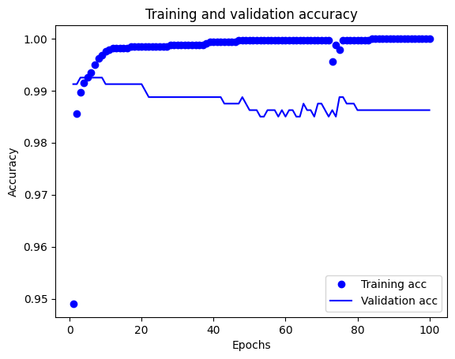

# Binary Classification on Tabular Data - Predicting Abnormal ECG Scans

## Introduction

In this notebook, you will train an autoencoder to detect anomalies on the ECG5000 dataset. This dataset contains 5,000 Electrocardiograms, each with 140 data points. You will use a simplified version of the dataset, where each example has been labeled either 0 (corresponding to an abnormal rhythm), or 1 (corresponding to a normal rhythm). You are interested in identifying the abnormal rhythms.

## Technical preliminaries


```python
import tensorflow as tf
from tensorflow import keras
import numpy as np
import pandas as pd
import matplotlib.pyplot as plt

# initialize the seeds of different random number generators so that the
# results will be the same every time the notebook is run
tf.random.set_seed(42)

pd.options.mode.chained_assignment = None
```

## Read in the data

Conveniently, the dataset in CSV form has been made available online and we can load it into a Pandas dataframe with the very useful `pd.read_csv` command.


```python
#Because each column of data represents a datapoint we will name the columns by the sequence of datapoints
# (1,2,3...140)
names = []
for i in range(140):
    names.append(i)
# The last column will be the target or dependent variable
names.append('Target')
```

#### Read in the data from http://storage.googleapis.com/download.tensorflow.org/data/ecg.csv and set the column names from the list created in the box above


```python
df = pd.read_csv("http://storage.googleapis.com/download.tensorflow.org/data/ecg.csv", header=None)

df.columns = names
```


```python
df.shape
```


    (4998, 141)


```python
df.head()
```


  <div id="df-b30b5dd7-f148-4a08-a24e-fe174dc4309c" class="colab-df-container">
    <div>
<style scoped>
    .dataframe tbody tr th:only-of-type {
        vertical-align: middle;
    }

    .dataframe tbody tr th {
        vertical-align: top;
    }

    .dataframe thead th {
        text-align: right;
    }
</style>
<table border="1" class="dataframe">
  <thead>
    <tr style="text-align: right;">
      <th></th>
      <th>0</th>
      <th>1</th>
      <th>2</th>
      <th>3</th>
      <th>4</th>
      <th>5</th>
      <th>6</th>
      <th>7</th>
      <th>8</th>
      <th>9</th>
      <th>...</th>
      <th>131</th>
      <th>132</th>
      <th>133</th>
      <th>134</th>
      <th>135</th>
      <th>136</th>
      <th>137</th>
      <th>138</th>
      <th>139</th>
      <th>Target</th>
    </tr>
  </thead>
  <tbody>
    <tr>
      <th>0</th>
      <td>-0.112522</td>
      <td>-2.827204</td>
      <td>-3.773897</td>
      <td>-4.349751</td>
      <td>-4.376041</td>
      <td>-3.474986</td>
      <td>-2.181408</td>
      <td>-1.818286</td>
      <td>-1.250522</td>
      <td>-0.477492</td>
      <td>...</td>
      <td>0.792168</td>
      <td>0.933541</td>
      <td>0.796958</td>
      <td>0.578621</td>
      <td>0.257740</td>
      <td>0.228077</td>
      <td>0.123431</td>
      <td>0.925286</td>
      <td>0.193137</td>
      <td>1.0</td>
    </tr>
    <tr>
      <th>1</th>
      <td>-1.100878</td>
      <td>-3.996840</td>
      <td>-4.285843</td>
      <td>-4.506579</td>
      <td>-4.022377</td>
      <td>-3.234368</td>
      <td>-1.566126</td>
      <td>-0.992258</td>
      <td>-0.754680</td>
      <td>0.042321</td>
      <td>...</td>
      <td>0.538356</td>
      <td>0.656881</td>
      <td>0.787490</td>
      <td>0.724046</td>
      <td>0.555784</td>
      <td>0.476333</td>
      <td>0.773820</td>
      <td>1.119621</td>
      <td>-1.436250</td>
      <td>1.0</td>
    </tr>
    <tr>
      <th>2</th>
      <td>-0.567088</td>
      <td>-2.593450</td>
      <td>-3.874230</td>
      <td>-4.584095</td>
      <td>-4.187449</td>
      <td>-3.151462</td>
      <td>-1.742940</td>
      <td>-1.490659</td>
      <td>-1.183580</td>
      <td>-0.394229</td>
      <td>...</td>
      <td>0.886073</td>
      <td>0.531452</td>
      <td>0.311377</td>
      <td>-0.021919</td>
      <td>-0.713683</td>
      <td>-0.532197</td>
      <td>0.321097</td>
      <td>0.904227</td>
      <td>-0.421797</td>
      <td>1.0</td>
    </tr>
    <tr>
      <th>3</th>
      <td>0.490473</td>
      <td>-1.914407</td>
      <td>-3.616364</td>
      <td>-4.318823</td>
      <td>-4.268016</td>
      <td>-3.881110</td>
      <td>-2.993280</td>
      <td>-1.671131</td>
      <td>-1.333884</td>
      <td>-0.965629</td>
      <td>...</td>
      <td>0.350816</td>
      <td>0.499111</td>
      <td>0.600345</td>
      <td>0.842069</td>
      <td>0.952074</td>
      <td>0.990133</td>
      <td>1.086798</td>
      <td>1.403011</td>
      <td>-0.383564</td>
      <td>1.0</td>
    </tr>
    <tr>
      <th>4</th>
      <td>0.800232</td>
      <td>-0.874252</td>
      <td>-2.384761</td>
      <td>-3.973292</td>
      <td>-4.338224</td>
      <td>-3.802422</td>
      <td>-2.534510</td>
      <td>-1.783423</td>
      <td>-1.594450</td>
      <td>-0.753199</td>
      <td>...</td>
      <td>1.148884</td>
      <td>0.958434</td>
      <td>1.059025</td>
      <td>1.371682</td>
      <td>1.277392</td>
      <td>0.960304</td>
      <td>0.971020</td>
      <td>1.614392</td>
      <td>1.421456</td>
      <td>1.0</td>
    </tr>
  </tbody>
</table>
<p>5 rows × 141 columns</p>
</div>
    <div class="colab-df-buttons">

  <div class="colab-df-container">
    <button class="colab-df-convert" onclick="convertToInteractive('df-b30b5dd7-f148-4a08-a24e-fe174dc4309c')"
            title="Convert this dataframe to an interactive table."
            style="display:none;">

  <svg xmlns="http://www.w3.org/2000/svg" height="24px" viewBox="0 -960 960 960">
    <path d="M120-120v-720h720v720H120Zm60-500h600v-160H180v160Zm220 220h160v-160H400v160Zm0 220h160v-160H400v160ZM180-400h160v-160H180v160Zm440 0h160v-160H620v160ZM180-180h160v-160H180v160Zm440 0h160v-160H620v160Z"/>
  </svg>
    </button>

  <style>
    .colab-df-container {
      display:flex;
      gap: 12px;
    }

    .colab-df-convert {
      background-color: #E8F0FE;
      border: none;
      border-radius: 50%;
      cursor: pointer;
      display: none;
      fill: #1967D2;
      height: 32px;
      padding: 0 0 0 0;
      width: 32px;
    }

    .colab-df-convert:hover {
      background-color: #E2EBFA;
      box-shadow: 0px 1px 2px rgba(60, 64, 67, 0.3), 0px 1px 3px 1px rgba(60, 64, 67, 0.15);
      fill: #174EA6;
    }

    .colab-df-buttons div {
      margin-bottom: 4px;
    }

    [theme=dark] .colab-df-convert {
      background-color: #3B4455;
      fill: #D2E3FC;
    }

    [theme=dark] .colab-df-convert:hover {
      background-color: #434B5C;
      box-shadow: 0px 1px 3px 1px rgba(0, 0, 0, 0.15);
      filter: drop-shadow(0px 1px 2px rgba(0, 0, 0, 0.3));
      fill: #FFFFFF;
    }
  </style>

    <script>
      const buttonEl =
        document.querySelector('#df-b30b5dd7-f148-4a08-a24e-fe174dc4309c button.colab-df-convert');
      buttonEl.style.display =
        google.colab.kernel.accessAllowed ? 'block' : 'none';

      async function convertToInteractive(key) {
        const element = document.querySelector('#df-b30b5dd7-f148-4a08-a24e-fe174dc4309c');
        const dataTable =
          await google.colab.kernel.invokeFunction('convertToInteractive',
                                                    [key], {});
        if (!dataTable) return;

        const docLinkHtml = 'Like what you see? Visit the ' +
          '<a target="_blank" href=https://colab.research.google.com/notebooks/data_table.ipynb>data table notebook</a>'
          + ' to learn more about interactive tables.';
        element.innerHTML = '';
        dataTable['output_type'] = 'display_data';
        await google.colab.output.renderOutput(dataTable, element);
        const docLink = document.createElement('div');
        docLink.innerHTML = docLinkHtml;
        element.appendChild(docLink);
      }
    </script>
  </div>


<div id="df-39116f5b-0f09-463d-9200-abbd5bb5b902">
  <button class="colab-df-quickchart" onclick="quickchart('df-39116f5b-0f09-463d-9200-abbd5bb5b902')"
            title="Suggest charts"
            style="display:none;">

<svg xmlns="http://www.w3.org/2000/svg" height="24px"viewBox="0 0 24 24"
     width="24px">
    <g>
        <path d="M19 3H5c-1.1 0-2 .9-2 2v14c0 1.1.9 2 2 2h14c1.1 0 2-.9 2-2V5c0-1.1-.9-2-2-2zM9 17H7v-7h2v7zm4 0h-2V7h2v10zm4 0h-2v-4h2v4z"/>
    </g>
</svg>
  </button>

<style>
  .colab-df-quickchart {
      --bg-color: #E8F0FE;
      --fill-color: #1967D2;
      --hover-bg-color: #E2EBFA;
      --hover-fill-color: #174EA6;
      --disabled-fill-color: #AAA;
      --disabled-bg-color: #DDD;
  }

  [theme=dark] .colab-df-quickchart {
      --bg-color: #3B4455;
      --fill-color: #D2E3FC;
      --hover-bg-color: #434B5C;
      --hover-fill-color: #FFFFFF;
      --disabled-bg-color: #3B4455;
      --disabled-fill-color: #666;
  }

  .colab-df-quickchart {
    background-color: var(--bg-color);
    border: none;
    border-radius: 50%;
    cursor: pointer;
    display: none;
    fill: var(--fill-color);
    height: 32px;
    padding: 0;
    width: 32px;
  }

  .colab-df-quickchart:hover {
    background-color: var(--hover-bg-color);
    box-shadow: 0 1px 2px rgba(60, 64, 67, 0.3), 0 1px 3px 1px rgba(60, 64, 67, 0.15);
    fill: var(--button-hover-fill-color);
  }

  .colab-df-quickchart-complete:disabled,
  .colab-df-quickchart-complete:disabled:hover {
    background-color: var(--disabled-bg-color);
    fill: var(--disabled-fill-color);
    box-shadow: none;
  }

  .colab-df-spinner {
    border: 2px solid var(--fill-color);
    border-color: transparent;
    border-bottom-color: var(--fill-color);
    animation:
      spin 1s steps(1) infinite;
  }

  @keyframes spin {
    0% {
      border-color: transparent;
      border-bottom-color: var(--fill-color);
      border-left-color: var(--fill-color);
    }
    20% {
      border-color: transparent;
      border-left-color: var(--fill-color);
      border-top-color: var(--fill-color);
    }
    30% {
      border-color: transparent;
      border-left-color: var(--fill-color);
      border-top-color: var(--fill-color);
      border-right-color: var(--fill-color);
    }
    40% {
      border-color: transparent;
      border-right-color: var(--fill-color);
      border-top-color: var(--fill-color);
    }
    60% {
      border-color: transparent;
      border-right-color: var(--fill-color);
    }
    80% {
      border-color: transparent;
      border-right-color: var(--fill-color);
      border-bottom-color: var(--fill-color);
    }
    90% {
      border-color: transparent;
      border-bottom-color: var(--fill-color);
    }
  }
</style>

  <script>
    async function quickchart(key) {
      const quickchartButtonEl =
        document.querySelector('#' + key + ' button');
      quickchartButtonEl.disabled = true;  // To prevent multiple clicks.
      quickchartButtonEl.classList.add('colab-df-spinner');
      try {
        const charts = await google.colab.kernel.invokeFunction(
            'suggestCharts', [key], {});
      } catch (error) {
        console.error('Error during call to suggestCharts:', error);
      }
      quickchartButtonEl.classList.remove('colab-df-spinner');
      quickchartButtonEl.classList.add('colab-df-quickchart-complete');
    }
    (() => {
      let quickchartButtonEl =
        document.querySelector('#df-39116f5b-0f09-463d-9200-abbd5bb5b902 button');
      quickchartButtonEl.style.display =
        google.colab.kernel.accessAllowed ? 'block' : 'none';
    })();
  </script>
</div>

    </div>
  </div>


## Preprocessing

This dataset only has numeric variables. For consistency sake, we will assign the column names to variable numerics.


```python
numerics = names

# Remove the dependent variable
numerics.remove('Target')
```


```python
# Set the output to "target_metrics"
target_metrics = df.Target.value_counts(normalize=True)
print(target_metrics)
```

    Target
    1.0    0.584034
    0.0    0.415966
    Name: proportion, dtype: float64


###### Extract the dependent variable


```python
#set the dependent variables to 'y'
y = df.pop('Target')
```


Before we normalize the numerics, let's split the data into an 80% training set and 20% test set (*why should we split **before** normalization?*).


```python
from sklearn.model_selection import train_test_split
```


```python
#split into train and test sets with the following naming conventions:
# X_train, X_test, y_train and y_test
X_train, X_test, y_train, y_test = train_test_split(df, y, test_size=0.2, stratify=y)
```

OK, let's calculate the mean and standard deviation of every numeric variable in the training set.


```python
# Assign the means to "means" and standard deviation to "sd"
means = X_train[numerics].mean()
sd = X_train[numerics].std()
print(means)
```

    0     -0.267138
    1     -1.648505
    2     -2.486585
    3     -3.109836
    4     -3.158222
             ...
    135   -0.771955
    136   -0.850764
    137   -0.661878
    138   -0.508294
    139   -0.720762
    Length: 140, dtype: float64


Let's normalize the train and test dataframes with these means and standard deviations.


```python
# Normalize X_train
X_train[numerics]= (X_train[numerics] - means)/sd
```


```python
# Normalize X_test
X_test[numerics]= (X_test[numerics] - means)/sd
```


```python
X_train.head()
```


  <div id="df-10745b84-488f-413c-98dc-c5824eddf63d" class="colab-df-container">
    <div>
<style scoped>
    .dataframe tbody tr th:only-of-type {
        vertical-align: middle;
    }

    .dataframe tbody tr th {
        vertical-align: top;
    }

    .dataframe thead th {
        text-align: right;
    }
</style>
<table border="1" class="dataframe">
  <thead>
    <tr style="text-align: right;">
      <th></th>
      <th>0</th>
      <th>1</th>
      <th>2</th>
      <th>3</th>
      <th>4</th>
      <th>5</th>
      <th>6</th>
      <th>7</th>
      <th>8</th>
      <th>9</th>
      <th>...</th>
      <th>130</th>
      <th>131</th>
      <th>132</th>
      <th>133</th>
      <th>134</th>
      <th>135</th>
      <th>136</th>
      <th>137</th>
      <th>138</th>
      <th>139</th>
    </tr>
  </thead>
  <tbody>
    <tr>
      <th>4057</th>
      <td>-0.339573</td>
      <td>-0.138697</td>
      <td>-0.194378</td>
      <td>-0.101219</td>
      <td>-0.017249</td>
      <td>-0.359260</td>
      <td>-0.787284</td>
      <td>-0.897221</td>
      <td>-0.602325</td>
      <td>-0.618527</td>
      <td>...</td>
      <td>-0.502409</td>
      <td>-0.734956</td>
      <td>-0.890447</td>
      <td>-0.958773</td>
      <td>-1.155775</td>
      <td>-1.149000</td>
      <td>-0.971180</td>
      <td>-0.673787</td>
      <td>-0.281925</td>
      <td>0.399284</td>
    </tr>
    <tr>
      <th>4291</th>
      <td>0.673696</td>
      <td>1.020317</td>
      <td>1.054318</td>
      <td>1.120141</td>
      <td>0.628515</td>
      <td>-0.244009</td>
      <td>-1.200724</td>
      <td>-1.778958</td>
      <td>-1.707809</td>
      <td>-1.532566</td>
      <td>...</td>
      <td>-1.660972</td>
      <td>-1.671977</td>
      <td>-1.673123</td>
      <td>-1.636669</td>
      <td>-1.484168</td>
      <td>-1.164322</td>
      <td>-0.761922</td>
      <td>-0.359350</td>
      <td>-0.040938</td>
      <td>0.419998</td>
    </tr>
    <tr>
      <th>1682</th>
      <td>-0.024878</td>
      <td>-0.198939</td>
      <td>-0.290153</td>
      <td>-0.554842</td>
      <td>-1.097760</td>
      <td>-1.399995</td>
      <td>-1.242124</td>
      <td>-0.158686</td>
      <td>0.004729</td>
      <td>-0.126173</td>
      <td>...</td>
      <td>0.699072</td>
      <td>0.691803</td>
      <td>0.810203</td>
      <td>0.795514</td>
      <td>0.727565</td>
      <td>0.633504</td>
      <td>0.549241</td>
      <td>0.408249</td>
      <td>0.088524</td>
      <td>-0.902304</td>
    </tr>
    <tr>
      <th>509</th>
      <td>-0.714724</td>
      <td>-0.218844</td>
      <td>0.062778</td>
      <td>0.156947</td>
      <td>0.045690</td>
      <td>-0.204441</td>
      <td>0.220480</td>
      <td>0.279434</td>
      <td>-0.291392</td>
      <td>-0.458194</td>
      <td>...</td>
      <td>1.059618</td>
      <td>0.969430</td>
      <td>0.602975</td>
      <td>0.322321</td>
      <td>0.447775</td>
      <td>0.603574</td>
      <td>0.845071</td>
      <td>0.905155</td>
      <td>0.783898</td>
      <td>0.737286</td>
    </tr>
    <tr>
      <th>2101</th>
      <td>-1.070893</td>
      <td>-0.701954</td>
      <td>-0.513473</td>
      <td>-0.424789</td>
      <td>-0.569792</td>
      <td>-0.726431</td>
      <td>-0.969389</td>
      <td>-0.285193</td>
      <td>-0.097366</td>
      <td>-0.523234</td>
      <td>...</td>
      <td>1.072114</td>
      <td>0.624257</td>
      <td>0.339410</td>
      <td>-0.096951</td>
      <td>-0.330801</td>
      <td>-0.438345</td>
      <td>-0.398881</td>
      <td>-0.367400</td>
      <td>-0.190093</td>
      <td>-0.572163</td>
    </tr>
  </tbody>
</table>
<p>5 rows × 140 columns</p>
</div>
    <div class="colab-df-buttons">

  <div class="colab-df-container">
    <button class="colab-df-convert" onclick="convertToInteractive('df-10745b84-488f-413c-98dc-c5824eddf63d')"
            title="Convert this dataframe to an interactive table."
            style="display:none;">

  <svg xmlns="http://www.w3.org/2000/svg" height="24px" viewBox="0 -960 960 960">
    <path d="M120-120v-720h720v720H120Zm60-500h600v-160H180v160Zm220 220h160v-160H400v160Zm0 220h160v-160H400v160ZM180-400h160v-160H180v160Zm440 0h160v-160H620v160ZM180-180h160v-160H180v160Zm440 0h160v-160H620v160Z"/>
  </svg>
    </button>

  <style>
    .colab-df-container {
      display:flex;
      gap: 12px;
    }

    .colab-df-convert {
      background-color: #E8F0FE;
      border: none;
      border-radius: 50%;
      cursor: pointer;
      display: none;
      fill: #1967D2;
      height: 32px;
      padding: 0 0 0 0;
      width: 32px;
    }

    .colab-df-convert:hover {
      background-color: #E2EBFA;
      box-shadow: 0px 1px 2px rgba(60, 64, 67, 0.3), 0px 1px 3px 1px rgba(60, 64, 67, 0.15);
      fill: #174EA6;
    }

    .colab-df-buttons div {
      margin-bottom: 4px;
    }

    [theme=dark] .colab-df-convert {
      background-color: #3B4455;
      fill: #D2E3FC;
    }

    [theme=dark] .colab-df-convert:hover {
      background-color: #434B5C;
      box-shadow: 0px 1px 3px 1px rgba(0, 0, 0, 0.15);
      filter: drop-shadow(0px 1px 2px rgba(0, 0, 0, 0.3));
      fill: #FFFFFF;
    }
  </style>

    <script>
      const buttonEl =
        document.querySelector('#df-10745b84-488f-413c-98dc-c5824eddf63d button.colab-df-convert');
      buttonEl.style.display =
        google.colab.kernel.accessAllowed ? 'block' : 'none';

      async function convertToInteractive(key) {
        const element = document.querySelector('#df-10745b84-488f-413c-98dc-c5824eddf63d');
        const dataTable =
          await google.colab.kernel.invokeFunction('convertToInteractive',
                                                    [key], {});
        if (!dataTable) return;

        const docLinkHtml = 'Like what you see? Visit the ' +
          '<a target="_blank" href=https://colab.research.google.com/notebooks/data_table.ipynb>data table notebook</a>'
          + ' to learn more about interactive tables.';
        element.innerHTML = '';
        dataTable['output_type'] = 'display_data';
        await google.colab.output.renderOutput(dataTable, element);
        const docLink = document.createElement('div');
        docLink.innerHTML = docLinkHtml;
        element.appendChild(docLink);
      }
    </script>
  </div>


<div id="df-d047acbc-d685-4621-8ce2-114a5d35ac68">
  <button class="colab-df-quickchart" onclick="quickchart('df-d047acbc-d685-4621-8ce2-114a5d35ac68')"
            title="Suggest charts"
            style="display:none;">

<svg xmlns="http://www.w3.org/2000/svg" height="24px"viewBox="0 0 24 24"
     width="24px">
    <g>
        <path d="M19 3H5c-1.1 0-2 .9-2 2v14c0 1.1.9 2 2 2h14c1.1 0 2-.9 2-2V5c0-1.1-.9-2-2-2zM9 17H7v-7h2v7zm4 0h-2V7h2v10zm4 0h-2v-4h2v4z"/>
    </g>
</svg>
  </button>

<style>
  .colab-df-quickchart {
      --bg-color: #E8F0FE;
      --fill-color: #1967D2;
      --hover-bg-color: #E2EBFA;
      --hover-fill-color: #174EA6;
      --disabled-fill-color: #AAA;
      --disabled-bg-color: #DDD;
  }

  [theme=dark] .colab-df-quickchart {
      --bg-color: #3B4455;
      --fill-color: #D2E3FC;
      --hover-bg-color: #434B5C;
      --hover-fill-color: #FFFFFF;
      --disabled-bg-color: #3B4455;
      --disabled-fill-color: #666;
  }

  .colab-df-quickchart {
    background-color: var(--bg-color);
    border: none;
    border-radius: 50%;
    cursor: pointer;
    display: none;
    fill: var(--fill-color);
    height: 32px;
    padding: 0;
    width: 32px;
  }

  .colab-df-quickchart:hover {
    background-color: var(--hover-bg-color);
    box-shadow: 0 1px 2px rgba(60, 64, 67, 0.3), 0 1px 3px 1px rgba(60, 64, 67, 0.15);
    fill: var(--button-hover-fill-color);
  }

  .colab-df-quickchart-complete:disabled,
  .colab-df-quickchart-complete:disabled:hover {
    background-color: var(--disabled-bg-color);
    fill: var(--disabled-fill-color);
    box-shadow: none;
  }

  .colab-df-spinner {
    border: 2px solid var(--fill-color);
    border-color: transparent;
    border-bottom-color: var(--fill-color);
    animation:
      spin 1s steps(1) infinite;
  }

  @keyframes spin {
    0% {
      border-color: transparent;
      border-bottom-color: var(--fill-color);
      border-left-color: var(--fill-color);
    }
    20% {
      border-color: transparent;
      border-left-color: var(--fill-color);
      border-top-color: var(--fill-color);
    }
    30% {
      border-color: transparent;
      border-left-color: var(--fill-color);
      border-top-color: var(--fill-color);
      border-right-color: var(--fill-color);
    }
    40% {
      border-color: transparent;
      border-right-color: var(--fill-color);
      border-top-color: var(--fill-color);
    }
    60% {
      border-color: transparent;
      border-right-color: var(--fill-color);
    }
    80% {
      border-color: transparent;
      border-right-color: var(--fill-color);
      border-bottom-color: var(--fill-color);
    }
    90% {
      border-color: transparent;
      border-bottom-color: var(--fill-color);
    }
  }
</style>

  <script>
    async function quickchart(key) {
      const quickchartButtonEl =
        document.querySelector('#' + key + ' button');
      quickchartButtonEl.disabled = true;  // To prevent multiple clicks.
      quickchartButtonEl.classList.add('colab-df-spinner');
      try {
        const charts = await google.colab.kernel.invokeFunction(
            'suggestCharts', [key], {});
      } catch (error) {
        console.error('Error during call to suggestCharts:', error);
      }
      quickchartButtonEl.classList.remove('colab-df-spinner');
      quickchartButtonEl.classList.add('colab-df-quickchart-complete');
    }
    (() => {
      let quickchartButtonEl =
        document.querySelector('#df-d047acbc-d685-4621-8ce2-114a5d35ac68 button');
      quickchartButtonEl.style.display =
        google.colab.kernel.accessAllowed ? 'block' : 'none';
    })();
  </script>
</div>

    </div>
  </div>


The easiest way to feed data to Keras/Tensorflow is as Numpy arrays so we convert our two dataframes to Numpy arrays.


```python
# Convert X_train and X_test to Numpy arrays
X_train = X_train.to_numpy()
X_test = X_test.to_numpy()
```


```python
X_train.shape, y_train.shape
```


    ((3998, 140), (3998,))


```python
X_test.shape, y_test.shape

```


    ((1000, 140), (1000,))


## Build a model

### Define model in Keras

Creating an NN  is usually just a few lines of Keras code.

* We will start with a single hidden layer.
* Since this is a *binary classification problem*, we will use a sigmoid activation in the output layer.


```python
#get the number of columns and assign it to "num_columns"

num_columns = X_train.shape[1]

# Define the input layer. assign it to "input"
input = keras.Input(shape=(num_columns,), dtype="float32")

# Feed the input vector to the hidden layer. Call it "h"
h = keras.layers.Dense(16, activation="relu", name="Hidden")(input)

# Feed the output of the hidden layer to the output layer. Call it "output"
output = keras.layers.Dense(1, activation="sigmoid", name="Output")(h)

# tell Keras that this (input,output) pair is your model. Call it "model"
model = keras.Model(input, output)
```


```python
model.summary()
```


<pre style="white-space:pre;overflow-x:auto;line-height:normal;font-family:Menlo,'DejaVu Sans Mono',consolas,'Courier New',monospace"><span style="font-weight: bold">Model: "functional"</span>
</pre>


<pre style="white-space:pre;overflow-x:auto;line-height:normal;font-family:Menlo,'DejaVu Sans Mono',consolas,'Courier New',monospace">┏━━━━━━━━━━━━━━━━━━━━━━━━━━━━━━━━━┳━━━━━━━━━━━━━━━━━━━━━━━━┳━━━━━━━━━━━━━━━┓
┃<span style="font-weight: bold"> Layer (type)                    </span>┃<span style="font-weight: bold"> Output Shape           </span>┃<span style="font-weight: bold">       Param # </span>┃
┡━━━━━━━━━━━━━━━━━━━━━━━━━━━━━━━━━╇━━━━━━━━━━━━━━━━━━━━━━━━╇━━━━━━━━━━━━━━━┩
│ input_layer (<span style="color: #0087ff; text-decoration-color: #0087ff">InputLayer</span>)        │ (<span style="color: #00d7ff; text-decoration-color: #00d7ff">None</span>, <span style="color: #00af00; text-decoration-color: #00af00">140</span>)            │             <span style="color: #00af00; text-decoration-color: #00af00">0</span> │
├─────────────────────────────────┼────────────────────────┼───────────────┤
│ Hidden (<span style="color: #0087ff; text-decoration-color: #0087ff">Dense</span>)                  │ (<span style="color: #00d7ff; text-decoration-color: #00d7ff">None</span>, <span style="color: #00af00; text-decoration-color: #00af00">16</span>)             │         <span style="color: #00af00; text-decoration-color: #00af00">2,256</span> │
├─────────────────────────────────┼────────────────────────┼───────────────┤
│ Output (<span style="color: #0087ff; text-decoration-color: #0087ff">Dense</span>)                  │ (<span style="color: #00d7ff; text-decoration-color: #00d7ff">None</span>, <span style="color: #00af00; text-decoration-color: #00af00">1</span>)              │            <span style="color: #00af00; text-decoration-color: #00af00">17</span> │
└─────────────────────────────────┴────────────────────────┴───────────────┘
</pre>


<pre style="white-space:pre;overflow-x:auto;line-height:normal;font-family:Menlo,'DejaVu Sans Mono',consolas,'Courier New',monospace"><span style="font-weight: bold"> Total params: </span><span style="color: #00af00; text-decoration-color: #00af00">2,273</span> (8.88 KB)
</pre>


<pre style="white-space:pre;overflow-x:auto;line-height:normal;font-family:Menlo,'DejaVu Sans Mono',consolas,'Courier New',monospace"><span style="font-weight: bold"> Trainable params: </span><span style="color: #00af00; text-decoration-color: #00af00">2,273</span> (8.88 KB)
</pre>


<pre style="white-space:pre;overflow-x:auto;line-height:normal;font-family:Menlo,'DejaVu Sans Mono',consolas,'Courier New',monospace"><span style="font-weight: bold"> Non-trainable params: </span><span style="color: #00af00; text-decoration-color: #00af00">0</span> (0.00 B)
</pre>


```python
keras.utils.plot_model(model, show_shapes=True)
```


### Set optimization parameters

Now that the model is defined, we need to tell Keras three things:

*   What **loss function** to use - Since our output variable is binary, we will select the `binary_crossentropy` loss function.
*   Which **optimizer** to use - we will use a 'flavor' of SGD called `adam` which is an excellent default choice
*   What **metrics** you want Keras to report out - in classification problems like this one, `accuracy` is commonly used.


```python
model.compile(optimizer="adam",
              loss="binary_crossentropy",
              metrics=["accuracy"])
```

## Train the model

To kickoff training, we have to decide on three things:
* The *batch size* - 32 is a good default
* The number of *epochs* (i.e., how many passes through the training data). Start by setting this to 100, but you can experiment with different values.
* Whether we want to use a validation set. This will be useful for overfitting detection and regularization via early stopping so we will ask Keras to automatically use 20% of the data points as a validation set


```python
# Fit your model and assign the output to "history"
history = model.fit(X_train,
                    y_train,
                    epochs=100,
                    batch_size=32,
                    validation_split=0.2)
```


```python
history_dict = history.history
history_dict.keys()
```


    dict_keys(['accuracy', 'loss', 'val_accuracy', 'val_loss'])


```python
loss_values = history_dict["loss"]
val_loss_values = history_dict["val_loss"]
epochs = range(1, len(loss_values) + 1)
plt.plot(epochs, loss_values, "bo", label="Training loss")
plt.plot(epochs, val_loss_values, "b", label="Validation loss")
plt.title("Training and validation loss")
plt.xlabel("Epochs")
plt.ylabel("Loss")
plt.legend()
plt.show()
```


```python
plt.clf()
acc = history_dict["accuracy"]
val_acc = history_dict["val_accuracy"]
plt.plot(epochs, acc, "bo", label="Training acc")
plt.plot(epochs, val_acc, "b", label="Validation acc")
plt.title("Training and validation accuracy")
plt.xlabel("Epochs")
plt.ylabel("Accuracy")
plt.legend()
plt.show()
```





## Evaluate the model

Let's see **how well the model does on the test set**.

`model.evaluate` is a very handy function to calculate the performance of your model on any dataset.


```python
# Getting the results of your model for grading
score, acc = model.evaluate(X_test, y_test)
```

    32/32 ━━━━━━━━━━━━━━━━━━━━ 0s 3ms/step - accuracy: 0.9930 - loss: 0.0454


```python
y.value_counts(normalize=True)
```


<div>
<style scoped>
    .dataframe tbody tr th:only-of-type {
        vertical-align: middle;
    }

    .dataframe tbody tr th {
        vertical-align: top;
    }

    .dataframe thead th {
        text-align: right;
    }
</style>
<table border="1" class="dataframe">
  <thead>
    <tr style="text-align: right;">
      <th></th>
      <th>proportion</th>
    </tr>
    <tr>
      <th>Target</th>
      <th></th>
    </tr>
  </thead>
  <tbody>
    <tr>
      <th>1.0</th>
      <td>0.584034</td>
    </tr>
    <tr>
      <th>0.0</th>
      <td>0.415966</td>
    </tr>
  </tbody>
</table>
</div><br><label><b>dtype:</b> float64</label>


```python
# Selecting a specific row (e.g., row index 300)
row_index = 300
y_values = X_train[row_index, :]
x_values = range(X_train.shape[1])  # X-axis: 0 to 139

# Plotting
plt.figure(figsize=(10, 5))
plt.plot(x_values, y_values, marker='o', linestyle='-')
plt.xlabel("X-Axis (Index)")
plt.ylabel("Y-Axis (Values)")
plt.title(f"Plot of Row {row_index}")
plt.grid(True)
plt.show()
```


```python
print(y_train[row_index])
```

    0.0

