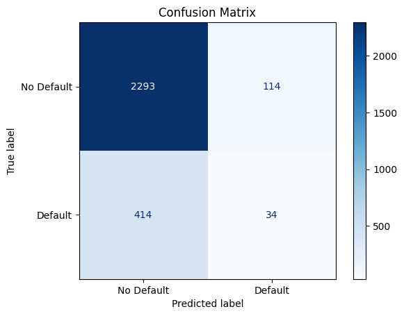
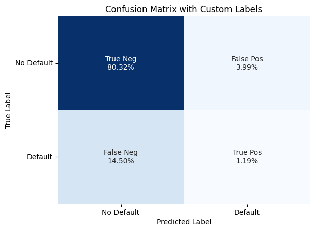

# Data Cleaning, EDA, and Statistical Modeling Workbook

[](https://colab.research.google.com/github/noportman/mitxpro/blob/main/files/prescriptive_model.ipynb)

This notebook walks through a full data analysis pipeline — from raw data ingestion and encoding detection to exploratory data analysis (EDA), statistical modeling, and model performance evaluation. Key tools include `chardet` and `codecs` for encoding detection, `pandas` and `skimpy` for data exploration, `statsmodels` for linear and logistic regression, and `scikit-learn` for evaluation metrics such as confusion matrices and accuracy scores.


```python
# Install dependencies, if needed
!pip install skimpy
```

    Collecting skimpy
      Downloading skimpy-0.0.18-py3-none-any.whl.metadata (34 kB)
    Requirement already satisfied: click>=8.1.7 in /usr/local/lib/python3.11/dist-packages (from skimpy) (8.1.8)
    Collecting ipykernel>=6.29.5 (from skimpy)
      Downloading ipykernel-6.29.5-py3-none-any.whl.metadata (6.3 kB)
    Requirement already satisfied: numpy>=2.0.2 in /usr/local/lib/python3.11/dist-packages (from skimpy) (2.0.2)
    Requirement already satisfied: pandas-stubs>=2.2.2.240807 in /usr/local/lib/python3.11/dist-packages (from skimpy) (2.2.2.240909)
    Collecting pandas>=2.2.3 (from skimpy)
      Downloading pandas-2.2.3-cp311-cp311-manylinux_2_17_x86_64.manylinux2014_x86_64.whl.metadata (89 kB)
         ━━━━━━━━━━━━━━━━━━━━━━━━━━━━━━━━━━━━━━━━ 89.9/89.9 kB 6.8 MB/s eta 0:00:00
    [?25hRequirement already satisfied: polars>=1.17.1 in /usr/local/lib/python3.11/dist-packages (from skimpy) (1.21.0)
    Requirement already satisfied: pygments>=2.18.0 in /usr/local/lib/python3.11/dist-packages (from skimpy) (2.18.0)
    Requirement already satisfied: rich>=13.9.4 in /usr/local/lib/python3.11/dist-packages (from skimpy) (13.9.4)
    Requirement already satisfied: typeguard>=4.4.1 in /usr/local/lib/python3.11/dist-packages (from skimpy) (4.4.2)
    Requirement already satisfied: pyarrow>=17.0.0 in /usr/local/lib/python3.11/dist-packages (from skimpy) (18.1.0)
    Collecting comm>=0.1.1 (from ipykernel>=6.29.5->skimpy)
      Downloading comm-0.2.2-py3-none-any.whl.metadata (3.7 kB)
    Requirement already satisfied: debugpy>=1.6.5 in /usr/local/lib/python3.11/dist-packages (from ipykernel>=6.29.5->skimpy) (1.8.0)
    Requirement already satisfied: ipython>=7.23.1 in /usr/local/lib/python3.11/dist-packages (from ipykernel>=6.29.5->skimpy) (7.34.0)
    Requirement already satisfied: jupyter-client>=6.1.12 in /usr/local/lib/python3.11/dist-packages (from ipykernel>=6.29.5->skimpy) (6.1.12)
    Requirement already satisfied: jupyter-core!=5.0.*,>=4.12 in /usr/local/lib/python3.11/dist-packages (from ipykernel>=6.29.5->skimpy) (5.7.2)
    Requirement already satisfied: matplotlib-inline>=0.1 in /usr/local/lib/python3.11/dist-packages (from ipykernel>=6.29.5->skimpy) (0.1.7)
    Requirement already satisfied: nest-asyncio in /usr/local/lib/python3.11/dist-packages (from ipykernel>=6.29.5->skimpy) (1.6.0)
    Requirement already satisfied: packaging in /usr/local/lib/python3.11/dist-packages (from ipykernel>=6.29.5->skimpy) (24.2)
    Requirement already satisfied: psutil in /usr/local/lib/python3.11/dist-packages (from ipykernel>=6.29.5->skimpy) (5.9.5)
    Requirement already satisfied: pyzmq>=24 in /usr/local/lib/python3.11/dist-packages (from ipykernel>=6.29.5->skimpy) (24.0.1)
    Requirement already satisfied: tornado>=6.1 in /usr/local/lib/python3.11/dist-packages (from ipykernel>=6.29.5->skimpy) (6.4.2)
    Requirement already satisfied: traitlets>=5.4.0 in /usr/local/lib/python3.11/dist-packages (from ipykernel>=6.29.5->skimpy) (5.7.1)
    Requirement already satisfied: python-dateutil>=2.8.2 in /usr/local/lib/python3.11/dist-packages (from pandas>=2.2.3->skimpy) (2.8.2)
    Requirement already satisfied: pytz>=2020.1 in /usr/local/lib/python3.11/dist-packages (from pandas>=2.2.3->skimpy) (2025.2)
    Requirement already satisfied: tzdata>=2022.7 in /usr/local/lib/python3.11/dist-packages (from pandas>=2.2.3->skimpy) (2025.2)
    Requirement already satisfied: types-pytz>=2022.1.1 in /usr/local/lib/python3.11/dist-packages (from pandas-stubs>=2.2.2.240807->skimpy) (2025.2.0.20250326)
    Requirement already satisfied: markdown-it-py>=2.2.0 in /usr/local/lib/python3.11/dist-packages (from rich>=13.9.4->skimpy) (3.0.0)
    Requirement already satisfied: typing_extensions>=4.10.0 in /usr/local/lib/python3.11/dist-packages (from typeguard>=4.4.1->skimpy) (4.13.1)
    Requirement already satisfied: setuptools>=18.5 in /usr/local/lib/python3.11/dist-packages (from ipython>=7.23.1->ipykernel>=6.29.5->skimpy) (75.2.0)
    Collecting jedi>=0.16 (from ipython>=7.23.1->ipykernel>=6.29.5->skimpy)
      Downloading jedi-0.19.2-py2.py3-none-any.whl.metadata (22 kB)
    Requirement already satisfied: decorator in /usr/local/lib/python3.11/dist-packages (from ipython>=7.23.1->ipykernel>=6.29.5->skimpy) (4.4.2)
    Requirement already satisfied: pickleshare in /usr/local/lib/python3.11/dist-packages (from ipython>=7.23.1->ipykernel>=6.29.5->skimpy) (0.7.5)
    Requirement already satisfied: prompt-toolkit!=3.0.0,!=3.0.1,<3.1.0,>=2.0.0 in /usr/local/lib/python3.11/dist-packages (from ipython>=7.23.1->ipykernel>=6.29.5->skimpy) (3.0.50)
    Requirement already satisfied: backcall in /usr/local/lib/python3.11/dist-packages (from ipython>=7.23.1->ipykernel>=6.29.5->skimpy) (0.2.0)
    Requirement already satisfied: pexpect>4.3 in /usr/local/lib/python3.11/dist-packages (from ipython>=7.23.1->ipykernel>=6.29.5->skimpy) (4.9.0)
    Requirement already satisfied: platformdirs>=2.5 in /usr/local/lib/python3.11/dist-packages (from jupyter-core!=5.0.*,>=4.12->ipykernel>=6.29.5->skimpy) (4.3.7)
    Requirement already satisfied: mdurl~=0.1 in /usr/local/lib/python3.11/dist-packages (from markdown-it-py>=2.2.0->rich>=13.9.4->skimpy) (0.1.2)
    Requirement already satisfied: six>=1.5 in /usr/local/lib/python3.11/dist-packages (from python-dateutil>=2.8.2->pandas>=2.2.3->skimpy) (1.17.0)
    Requirement already satisfied: parso<0.9.0,>=0.8.4 in /usr/local/lib/python3.11/dist-packages (from jedi>=0.16->ipython>=7.23.1->ipykernel>=6.29.5->skimpy) (0.8.4)
    Requirement already satisfied: ptyprocess>=0.5 in /usr/local/lib/python3.11/dist-packages (from pexpect>4.3->ipython>=7.23.1->ipykernel>=6.29.5->skimpy) (0.7.0)
    Requirement already satisfied: wcwidth in /usr/local/lib/python3.11/dist-packages (from prompt-toolkit!=3.0.0,!=3.0.1,<3.1.0,>=2.0.0->ipython>=7.23.1->ipykernel>=6.29.5->skimpy) (0.2.13)
    Downloading skimpy-0.0.18-py3-none-any.whl (17 kB)
    Downloading ipykernel-6.29.5-py3-none-any.whl (117 kB)
       ━━━━━━━━━━━━━━━━━━━━━━━━━━━━━━━━━━━━━━━━ 117.2/117.2 kB 9.5 MB/s eta 0:00:00
    [?25hDownloading pandas-2.2.3-cp311-cp311-manylinux_2_17_x86_64.manylinux2014_x86_64.whl (13.1 MB)
       ━━━━━━━━━━━━━━━━━━━━━━━━━━━━━━━━━━━━━━━━ 13.1/13.1 MB 74.0 MB/s eta 0:00:00
    [?25hDownloading comm-0.2.2-py3-none-any.whl (7.2 kB)
    Downloading jedi-0.19.2-py2.py3-none-any.whl (1.6 MB)
       ━━━━━━━━━━━━━━━━━━━━━━━━━━━━━━━━━━━━━━━━ 1.6/1.6 MB 47.4 MB/s eta 0:00:00
    [?25hInstalling collected packages: jedi, comm, pandas, ipykernel, skimpy
      Attempting uninstall: pandas
        Found existing installation: pandas 2.2.2
        Uninstalling pandas-2.2.2:
          Successfully uninstalled pandas-2.2.2
      Attempting uninstall: ipykernel
        Found existing installation: ipykernel 6.17.1
        Uninstalling ipykernel-6.17.1:
          Successfully uninstalled ipykernel-6.17.1
    ERROR: pip's dependency resolver does not currently take into account all the packages that are installed. This behaviour is the source of the following dependency conflicts.
    google-colab 1.0.0 requires ipykernel==6.17.1, but you have ipykernel 6.29.5 which is incompatible.
    google-colab 1.0.0 requires pandas==2.2.2, but you have pandas 2.2.3 which is incompatible.
    Successfully installed comm-0.2.2 ipykernel-6.29.5 jedi-0.19.2 pandas-2.2.3 skimpy-0.0.18
    


```python
import chardet
import pandas as pd

# Read the CSV file using the detected encoding and specifying the delimiter

url = "https://docs.google.com/spreadsheets/d/10L8BpkV4q1Zsou4daYoWul_8PFA9rsv2/export?format=csv&id=10L8BpkV4q1Zsou4daYoWul_8PFA9rsv2&gid=1710894028"
df = pd.read_csv(url, index_col = False)

df.head()
```


  <div id="df-74abfa27-bb96-43c9-ba5b-9ea684198c31" class="colab-df-container">
    <div>
<style scoped>
    .dataframe tbody tr th:only-of-type {
        vertical-align: middle;
    }

    .dataframe tbody tr th {
        vertical-align: top;
    }

    .dataframe thead th {
        text-align: right;
    }
</style>
<table border="1" class="dataframe">
  <thead>
    <tr style="text-align: right;">
      <th></th>
      <th>default</th>
      <th>installment</th>
      <th>log_income</th>
      <th>fico_score</th>
      <th>rev_balance</th>
      <th>inquiries</th>
      <th>records</th>
    </tr>
  </thead>
  <tbody>
    <tr>
      <th>0</th>
      <td>0</td>
      <td>829</td>
      <td>4.93</td>
      <td>737</td>
      <td>28.85</td>
      <td>0</td>
      <td>0</td>
    </tr>
    <tr>
      <th>1</th>
      <td>0</td>
      <td>228</td>
      <td>4.81</td>
      <td>707</td>
      <td>33.62</td>
      <td>0</td>
      <td>0</td>
    </tr>
    <tr>
      <th>2</th>
      <td>0</td>
      <td>367</td>
      <td>4.51</td>
      <td>682</td>
      <td>3.51</td>
      <td>1</td>
      <td>0</td>
    </tr>
    <tr>
      <th>3</th>
      <td>0</td>
      <td>162</td>
      <td>4.93</td>
      <td>712</td>
      <td>33.67</td>
      <td>1</td>
      <td>0</td>
    </tr>
    <tr>
      <th>4</th>
      <td>0</td>
      <td>103</td>
      <td>4.91</td>
      <td>667</td>
      <td>4.74</td>
      <td>0</td>
      <td>0</td>
    </tr>
  </tbody>
</table>
</div>
    <div class="colab-df-buttons">

  <div class="colab-df-container">
    <button class="colab-df-convert" onclick="convertToInteractive('df-74abfa27-bb96-43c9-ba5b-9ea684198c31')"
            title="Convert this dataframe to an interactive table."
            style="display:none;">

  <svg xmlns="http://www.w3.org/2000/svg" height="24px" viewBox="0 -960 960 960">
    <path d="M120-120v-720h720v720H120Zm60-500h600v-160H180v160Zm220 220h160v-160H400v160Zm0 220h160v-160H400v160ZM180-400h160v-160H180v160Zm440 0h160v-160H620v160ZM180-180h160v-160H180v160Zm440 0h160v-160H620v160Z"/>
  </svg>
    </button>

  <style>
    .colab-df-container {
      display:flex;
      gap: 12px;
    }

    .colab-df-convert {
      background-color: #E8F0FE;
      border: none;
      border-radius: 50%;
      cursor: pointer;
      display: none;
      fill: #1967D2;
      height: 32px;
      padding: 0 0 0 0;
      width: 32px;
    }

    .colab-df-convert:hover {
      background-color: #E2EBFA;
      box-shadow: 0px 1px 2px rgba(60, 64, 67, 0.3), 0px 1px 3px 1px rgba(60, 64, 67, 0.15);
      fill: #174EA6;
    }

    .colab-df-buttons div {
      margin-bottom: 4px;
    }

    [theme=dark] .colab-df-convert {
      background-color: #3B4455;
      fill: #D2E3FC;
    }

    [theme=dark] .colab-df-convert:hover {
      background-color: #434B5C;
      box-shadow: 0px 1px 3px 1px rgba(0, 0, 0, 0.15);
      filter: drop-shadow(0px 1px 2px rgba(0, 0, 0, 0.3));
      fill: #FFFFFF;
    }
  </style>

    <script>
      const buttonEl =
        document.querySelector('#df-74abfa27-bb96-43c9-ba5b-9ea684198c31 button.colab-df-convert');
      buttonEl.style.display =
        google.colab.kernel.accessAllowed ? 'block' : 'none';

      async function convertToInteractive(key) {
        const element = document.querySelector('#df-74abfa27-bb96-43c9-ba5b-9ea684198c31');
        const dataTable =
          await google.colab.kernel.invokeFunction('convertToInteractive',
                                                    [key], {});
        if (!dataTable) return;

        const docLinkHtml = 'Like what you see? Visit the ' +
          '<a target="_blank" href=https://colab.research.google.com/notebooks/data_table.ipynb>data table notebook</a>'
          + ' to learn more about interactive tables.';
        element.innerHTML = '';
        dataTable['output_type'] = 'display_data';
        await google.colab.output.renderOutput(dataTable, element);
        const docLink = document.createElement('div');
        docLink.innerHTML = docLinkHtml;
        element.appendChild(docLink);
      }
    </script>
  </div>


<div id="df-690c328b-be55-421a-8830-7802a79daa22">
  <button class="colab-df-quickchart" onclick="quickchart('df-690c328b-be55-421a-8830-7802a79daa22')"
            title="Suggest charts"
            style="display:none;">

<svg xmlns="http://www.w3.org/2000/svg" height="24px"viewBox="0 0 24 24"
     width="24px">
    <g>
        <path d="M19 3H5c-1.1 0-2 .9-2 2v14c0 1.1.9 2 2 2h14c1.1 0 2-.9 2-2V5c0-1.1-.9-2-2-2zM9 17H7v-7h2v7zm4 0h-2V7h2v10zm4 0h-2v-4h2v4z"/>
    </g>
</svg>
  </button>

<style>
  .colab-df-quickchart {
      --bg-color: #E8F0FE;
      --fill-color: #1967D2;
      --hover-bg-color: #E2EBFA;
      --hover-fill-color: #174EA6;
      --disabled-fill-color: #AAA;
      --disabled-bg-color: #DDD;
  }

  [theme=dark] .colab-df-quickchart {
      --bg-color: #3B4455;
      --fill-color: #D2E3FC;
      --hover-bg-color: #434B5C;
      --hover-fill-color: #FFFFFF;
      --disabled-bg-color: #3B4455;
      --disabled-fill-color: #666;
  }

  .colab-df-quickchart {
    background-color: var(--bg-color);
    border: none;
    border-radius: 50%;
    cursor: pointer;
    display: none;
    fill: var(--fill-color);
    height: 32px;
    padding: 0;
    width: 32px;
  }

  .colab-df-quickchart:hover {
    background-color: var(--hover-bg-color);
    box-shadow: 0 1px 2px rgba(60, 64, 67, 0.3), 0 1px 3px 1px rgba(60, 64, 67, 0.15);
    fill: var(--button-hover-fill-color);
  }

  .colab-df-quickchart-complete:disabled,
  .colab-df-quickchart-complete:disabled:hover {
    background-color: var(--disabled-bg-color);
    fill: var(--disabled-fill-color);
    box-shadow: none;
  }

  .colab-df-spinner {
    border: 2px solid var(--fill-color);
    border-color: transparent;
    border-bottom-color: var(--fill-color);
    animation:
      spin 1s steps(1) infinite;
  }

  @keyframes spin {
    0% {
      border-color: transparent;
      border-bottom-color: var(--fill-color);
      border-left-color: var(--fill-color);
    }
    20% {
      border-color: transparent;
      border-left-color: var(--fill-color);
      border-top-color: var(--fill-color);
    }
    30% {
      border-color: transparent;
      border-left-color: var(--fill-color);
      border-top-color: var(--fill-color);
      border-right-color: var(--fill-color);
    }
    40% {
      border-color: transparent;
      border-right-color: var(--fill-color);
      border-top-color: var(--fill-color);
    }
    60% {
      border-color: transparent;
      border-right-color: var(--fill-color);
    }
    80% {
      border-color: transparent;
      border-right-color: var(--fill-color);
      border-bottom-color: var(--fill-color);
    }
    90% {
      border-color: transparent;
      border-bottom-color: var(--fill-color);
    }
  }
</style>

  <script>
    async function quickchart(key) {
      const quickchartButtonEl =
        document.querySelector('#' + key + ' button');
      quickchartButtonEl.disabled = true;  // To prevent multiple clicks.
      quickchartButtonEl.classList.add('colab-df-spinner');
      try {
        const charts = await google.colab.kernel.invokeFunction(
            'suggestCharts', [key], {});
      } catch (error) {
        console.error('Error during call to suggestCharts:', error);
      }
      quickchartButtonEl.classList.remove('colab-df-spinner');
      quickchartButtonEl.classList.add('colab-df-quickchart-complete');
    }
    (() => {
      let quickchartButtonEl =
        document.querySelector('#df-690c328b-be55-421a-8830-7802a79daa22 button');
      quickchartButtonEl.style.display =
        google.colab.kernel.accessAllowed ? 'block' : 'none';
    })();
  </script>
</div>

    </div>
  </div>


```python
#imports packages to be used in the code
import numpy as np
import codecs
import pandas as pd
import matplotlib.pyplot as plt
import seaborn as sns
import statsmodels.api as sm
import sklearn as skl
from statsmodels.formula.api import ols
from statsmodels.formula.api import logit
from scipy.stats import norm
from sklearn.model_selection import train_test_split
from sklearn.metrics import ConfusionMatrixDisplay
from sklearn.metrics import confusion_matrix
from sklearn.metrics import accuracy_score
from skimpy import skim

print(skl.__version__)

df
```

    1.6.1
    


  <div id="df-31a10bc6-34ae-4d2c-b1e3-37819b9befd5" class="colab-df-container">
    <div>
<style scoped>
    .dataframe tbody tr th:only-of-type {
        vertical-align: middle;
    }

    .dataframe tbody tr th {
        vertical-align: top;
    }

    .dataframe thead th {
        text-align: right;
    }
</style>
<table border="1" class="dataframe">
  <thead>
    <tr style="text-align: right;">
      <th></th>
      <th>default</th>
      <th>installment</th>
      <th>log_income</th>
      <th>fico_score</th>
      <th>rev_balance</th>
      <th>inquiries</th>
      <th>records</th>
    </tr>
  </thead>
  <tbody>
    <tr>
      <th>0</th>
      <td>0</td>
      <td>829</td>
      <td>4.93</td>
      <td>737</td>
      <td>28.85</td>
      <td>0</td>
      <td>0</td>
    </tr>
    <tr>
      <th>1</th>
      <td>0</td>
      <td>228</td>
      <td>4.81</td>
      <td>707</td>
      <td>33.62</td>
      <td>0</td>
      <td>0</td>
    </tr>
    <tr>
      <th>2</th>
      <td>0</td>
      <td>367</td>
      <td>4.51</td>
      <td>682</td>
      <td>3.51</td>
      <td>1</td>
      <td>0</td>
    </tr>
    <tr>
      <th>3</th>
      <td>0</td>
      <td>162</td>
      <td>4.93</td>
      <td>712</td>
      <td>33.67</td>
      <td>1</td>
      <td>0</td>
    </tr>
    <tr>
      <th>4</th>
      <td>0</td>
      <td>103</td>
      <td>4.91</td>
      <td>667</td>
      <td>4.74</td>
      <td>0</td>
      <td>0</td>
    </tr>
    <tr>
      <th>...</th>
      <td>...</td>
      <td>...</td>
      <td>...</td>
      <td>...</td>
      <td>...</td>
      <td>...</td>
      <td>...</td>
    </tr>
    <tr>
      <th>9511</th>
      <td>1</td>
      <td>345</td>
      <td>5.29</td>
      <td>672</td>
      <td>215.37</td>
      <td>2</td>
      <td>0</td>
    </tr>
    <tr>
      <th>9512</th>
      <td>1</td>
      <td>258</td>
      <td>4.84</td>
      <td>722</td>
      <td>0.18</td>
      <td>5</td>
      <td>0</td>
    </tr>
    <tr>
      <th>9513</th>
      <td>1</td>
      <td>98</td>
      <td>4.60</td>
      <td>687</td>
      <td>10.04</td>
      <td>8</td>
      <td>0</td>
    </tr>
    <tr>
      <th>9514</th>
      <td>1</td>
      <td>352</td>
      <td>4.70</td>
      <td>692</td>
      <td>0.00</td>
      <td>5</td>
      <td>0</td>
    </tr>
    <tr>
      <th>9515</th>
      <td>1</td>
      <td>853</td>
      <td>4.89</td>
      <td>732</td>
      <td>37.88</td>
      <td>6</td>
      <td>0</td>
    </tr>
  </tbody>
</table>
<p>9516 rows × 7 columns</p>
</div>
    <div class="colab-df-buttons">

  <div class="colab-df-container">
    <button class="colab-df-convert" onclick="convertToInteractive('df-31a10bc6-34ae-4d2c-b1e3-37819b9befd5')"
            title="Convert this dataframe to an interactive table."
            style="display:none;">

  <svg xmlns="http://www.w3.org/2000/svg" height="24px" viewBox="0 -960 960 960">
    <path d="M120-120v-720h720v720H120Zm60-500h600v-160H180v160Zm220 220h160v-160H400v160Zm0 220h160v-160H400v160ZM180-400h160v-160H180v160Zm440 0h160v-160H620v160ZM180-180h160v-160H180v160Zm440 0h160v-160H620v160Z"/>
  </svg>
    </button>

  <style>
    .colab-df-container {
      display:flex;
      gap: 12px;
    }

    .colab-df-convert {
      background-color: #E8F0FE;
      border: none;
      border-radius: 50%;
      cursor: pointer;
      display: none;
      fill: #1967D2;
      height: 32px;
      padding: 0 0 0 0;
      width: 32px;
    }

    .colab-df-convert:hover {
      background-color: #E2EBFA;
      box-shadow: 0px 1px 2px rgba(60, 64, 67, 0.3), 0px 1px 3px 1px rgba(60, 64, 67, 0.15);
      fill: #174EA6;
    }

    .colab-df-buttons div {
      margin-bottom: 4px;
    }

    [theme=dark] .colab-df-convert {
      background-color: #3B4455;
      fill: #D2E3FC;
    }

    [theme=dark] .colab-df-convert:hover {
      background-color: #434B5C;
      box-shadow: 0px 1px 3px 1px rgba(0, 0, 0, 0.15);
      filter: drop-shadow(0px 1px 2px rgba(0, 0, 0, 0.3));
      fill: #FFFFFF;
    }
  </style>

    <script>
      const buttonEl =
        document.querySelector('#df-31a10bc6-34ae-4d2c-b1e3-37819b9befd5 button.colab-df-convert');
      buttonEl.style.display =
        google.colab.kernel.accessAllowed ? 'block' : 'none';

      async function convertToInteractive(key) {
        const element = document.querySelector('#df-31a10bc6-34ae-4d2c-b1e3-37819b9befd5');
        const dataTable =
          await google.colab.kernel.invokeFunction('convertToInteractive',
                                                    [key], {});
        if (!dataTable) return;

        const docLinkHtml = 'Like what you see? Visit the ' +
          '<a target="_blank" href=https://colab.research.google.com/notebooks/data_table.ipynb>data table notebook</a>'
          + ' to learn more about interactive tables.';
        element.innerHTML = '';
        dataTable['output_type'] = 'display_data';
        await google.colab.output.renderOutput(dataTable, element);
        const docLink = document.createElement('div');
        docLink.innerHTML = docLinkHtml;
        element.appendChild(docLink);
      }
    </script>
  </div>


<div id="df-6381fcc3-9b00-4bd2-ad08-14b6e48a77cc">
  <button class="colab-df-quickchart" onclick="quickchart('df-6381fcc3-9b00-4bd2-ad08-14b6e48a77cc')"
            title="Suggest charts"
            style="display:none;">

<svg xmlns="http://www.w3.org/2000/svg" height="24px"viewBox="0 0 24 24"
     width="24px">
    <g>
        <path d="M19 3H5c-1.1 0-2 .9-2 2v14c0 1.1.9 2 2 2h14c1.1 0 2-.9 2-2V5c0-1.1-.9-2-2-2zM9 17H7v-7h2v7zm4 0h-2V7h2v10zm4 0h-2v-4h2v4z"/>
    </g>
</svg>
  </button>

<style>
  .colab-df-quickchart {
      --bg-color: #E8F0FE;
      --fill-color: #1967D2;
      --hover-bg-color: #E2EBFA;
      --hover-fill-color: #174EA6;
      --disabled-fill-color: #AAA;
      --disabled-bg-color: #DDD;
  }

  [theme=dark] .colab-df-quickchart {
      --bg-color: #3B4455;
      --fill-color: #D2E3FC;
      --hover-bg-color: #434B5C;
      --hover-fill-color: #FFFFFF;
      --disabled-bg-color: #3B4455;
      --disabled-fill-color: #666;
  }

  .colab-df-quickchart {
    background-color: var(--bg-color);
    border: none;
    border-radius: 50%;
    cursor: pointer;
    display: none;
    fill: var(--fill-color);
    height: 32px;
    padding: 0;
    width: 32px;
  }

  .colab-df-quickchart:hover {
    background-color: var(--hover-bg-color);
    box-shadow: 0 1px 2px rgba(60, 64, 67, 0.3), 0 1px 3px 1px rgba(60, 64, 67, 0.15);
    fill: var(--button-hover-fill-color);
  }

  .colab-df-quickchart-complete:disabled,
  .colab-df-quickchart-complete:disabled:hover {
    background-color: var(--disabled-bg-color);
    fill: var(--disabled-fill-color);
    box-shadow: none;
  }

  .colab-df-spinner {
    border: 2px solid var(--fill-color);
    border-color: transparent;
    border-bottom-color: var(--fill-color);
    animation:
      spin 1s steps(1) infinite;
  }

  @keyframes spin {
    0% {
      border-color: transparent;
      border-bottom-color: var(--fill-color);
      border-left-color: var(--fill-color);
    }
    20% {
      border-color: transparent;
      border-left-color: var(--fill-color);
      border-top-color: var(--fill-color);
    }
    30% {
      border-color: transparent;
      border-left-color: var(--fill-color);
      border-top-color: var(--fill-color);
      border-right-color: var(--fill-color);
    }
    40% {
      border-color: transparent;
      border-right-color: var(--fill-color);
      border-top-color: var(--fill-color);
    }
    60% {
      border-color: transparent;
      border-right-color: var(--fill-color);
    }
    80% {
      border-color: transparent;
      border-right-color: var(--fill-color);
      border-bottom-color: var(--fill-color);
    }
    90% {
      border-color: transparent;
      border-bottom-color: var(--fill-color);
    }
  }
</style>

  <script>
    async function quickchart(key) {
      const quickchartButtonEl =
        document.querySelector('#' + key + ' button');
      quickchartButtonEl.disabled = true;  // To prevent multiple clicks.
      quickchartButtonEl.classList.add('colab-df-spinner');
      try {
        const charts = await google.colab.kernel.invokeFunction(
            'suggestCharts', [key], {});
      } catch (error) {
        console.error('Error during call to suggestCharts:', error);
      }
      quickchartButtonEl.classList.remove('colab-df-spinner');
      quickchartButtonEl.classList.add('colab-df-quickchart-complete');
    }
    (() => {
      let quickchartButtonEl =
        document.querySelector('#df-6381fcc3-9b00-4bd2-ad08-14b6e48a77cc button');
      quickchartButtonEl.style.display =
        google.colab.kernel.accessAllowed ? 'block' : 'none';
    })();
  </script>
</div>

  <div id="id_18b2111b-c70b-4b6e-a889-c9b9a56af4cc">
    <style>
      .colab-df-generate {
        background-color: #E8F0FE;
        border: none;
        border-radius: 50%;
        cursor: pointer;
        display: none;
        fill: #1967D2;
        height: 32px;
        padding: 0 0 0 0;
        width: 32px;
      }

      .colab-df-generate:hover {
        background-color: #E2EBFA;
        box-shadow: 0px 1px 2px rgba(60, 64, 67, 0.3), 0px 1px 3px 1px rgba(60, 64, 67, 0.15);
        fill: #174EA6;
      }

      [theme=dark] .colab-df-generate {
        background-color: #3B4455;
        fill: #D2E3FC;
      }

      [theme=dark] .colab-df-generate:hover {
        background-color: #434B5C;
        box-shadow: 0px 1px 3px 1px rgba(0, 0, 0, 0.15);
        filter: drop-shadow(0px 1px 2px rgba(0, 0, 0, 0.3));
        fill: #FFFFFF;
      }
    </style>
    <button class="colab-df-generate" onclick="generateWithVariable('df')"
            title="Generate code using this dataframe."
            style="display:none;">

  <svg xmlns="http://www.w3.org/2000/svg" height="24px"viewBox="0 0 24 24"
       width="24px">
    <path d="M7,19H8.4L18.45,9,17,7.55,7,17.6ZM5,21V16.75L18.45,3.32a2,2,0,0,1,2.83,0l1.4,1.43a1.91,1.91,0,0,1,.58,1.4,1.91,1.91,0,0,1-.58,1.4L9.25,21ZM18.45,9,17,7.55Zm-12,3A5.31,5.31,0,0,0,4.9,8.1,5.31,5.31,0,0,0,1,6.5,5.31,5.31,0,0,0,4.9,4.9,5.31,5.31,0,0,0,6.5,1,5.31,5.31,0,0,0,8.1,4.9,5.31,5.31,0,0,0,12,6.5,5.46,5.46,0,0,0,6.5,12Z"/>
  </svg>
    </button>
    <script>
      (() => {
      const buttonEl =
        document.querySelector('#id_18b2111b-c70b-4b6e-a889-c9b9a56af4cc button.colab-df-generate');
      buttonEl.style.display =
        google.colab.kernel.accessAllowed ? 'block' : 'none';

      buttonEl.onclick = () => {
        google.colab.notebook.generateWithVariable('df');
      }
      })();
    </script>
  </div>

    </div>
  </div>


```python
!pip install wget
```

    Collecting wget
      Downloading wget-3.2.zip (10 kB)
      Preparing metadata (setup.py) ... [?25l[?25hdone
    Building wheels for collected packages: wget
      Building wheel for wget (setup.py) ... [?25l[?25hdone
      Created wheel for wget: filename=wget-3.2-py3-none-any.whl size=9655 sha256=78ff164fdbc7e40a7707819f40a2cf24de36f1f471bf6ba2be67e85fccf89fe0
      Stored in directory: /root/.cache/pip/wheels/40/b3/0f/a40dbd1c6861731779f62cc4babcb234387e11d697df70ee97
    Successfully built wget
    Installing collected packages: wget
    Successfully installed wget-3.2
    


```python
# shows first 6 rows of dataframe
df.head(6)
```


  <div id="df-b1f5b5a0-beec-4732-bdfb-65cb2eb5dc1f" class="colab-df-container">
    <div>
<style scoped>
    .dataframe tbody tr th:only-of-type {
        vertical-align: middle;
    }

    .dataframe tbody tr th {
        vertical-align: top;
    }

    .dataframe thead th {
        text-align: right;
    }
</style>
<table border="1" class="dataframe">
  <thead>
    <tr style="text-align: right;">
      <th></th>
      <th>default</th>
      <th>installment</th>
      <th>log_income</th>
      <th>fico_score</th>
      <th>rev_balance</th>
      <th>inquiries</th>
      <th>records</th>
    </tr>
  </thead>
  <tbody>
    <tr>
      <th>0</th>
      <td>0</td>
      <td>829</td>
      <td>4.93</td>
      <td>737</td>
      <td>28.85</td>
      <td>0</td>
      <td>0</td>
    </tr>
    <tr>
      <th>1</th>
      <td>0</td>
      <td>228</td>
      <td>4.81</td>
      <td>707</td>
      <td>33.62</td>
      <td>0</td>
      <td>0</td>
    </tr>
    <tr>
      <th>2</th>
      <td>0</td>
      <td>367</td>
      <td>4.51</td>
      <td>682</td>
      <td>3.51</td>
      <td>1</td>
      <td>0</td>
    </tr>
    <tr>
      <th>3</th>
      <td>0</td>
      <td>162</td>
      <td>4.93</td>
      <td>712</td>
      <td>33.67</td>
      <td>1</td>
      <td>0</td>
    </tr>
    <tr>
      <th>4</th>
      <td>0</td>
      <td>103</td>
      <td>4.91</td>
      <td>667</td>
      <td>4.74</td>
      <td>0</td>
      <td>0</td>
    </tr>
    <tr>
      <th>5</th>
      <td>0</td>
      <td>125</td>
      <td>5.17</td>
      <td>727</td>
      <td>50.81</td>
      <td>0</td>
      <td>0</td>
    </tr>
  </tbody>
</table>
</div>
    <div class="colab-df-buttons">

  <div class="colab-df-container">
    <button class="colab-df-convert" onclick="convertToInteractive('df-b1f5b5a0-beec-4732-bdfb-65cb2eb5dc1f')"
            title="Convert this dataframe to an interactive table."
            style="display:none;">

  <svg xmlns="http://www.w3.org/2000/svg" height="24px" viewBox="0 -960 960 960">
    <path d="M120-120v-720h720v720H120Zm60-500h600v-160H180v160Zm220 220h160v-160H400v160Zm0 220h160v-160H400v160ZM180-400h160v-160H180v160Zm440 0h160v-160H620v160ZM180-180h160v-160H180v160Zm440 0h160v-160H620v160Z"/>
  </svg>
    </button>

  <style>
    .colab-df-container {
      display:flex;
      gap: 12px;
    }

    .colab-df-convert {
      background-color: #E8F0FE;
      border: none;
      border-radius: 50%;
      cursor: pointer;
      display: none;
      fill: #1967D2;
      height: 32px;
      padding: 0 0 0 0;
      width: 32px;
    }

    .colab-df-convert:hover {
      background-color: #E2EBFA;
      box-shadow: 0px 1px 2px rgba(60, 64, 67, 0.3), 0px 1px 3px 1px rgba(60, 64, 67, 0.15);
      fill: #174EA6;
    }

    .colab-df-buttons div {
      margin-bottom: 4px;
    }

    [theme=dark] .colab-df-convert {
      background-color: #3B4455;
      fill: #D2E3FC;
    }

    [theme=dark] .colab-df-convert:hover {
      background-color: #434B5C;
      box-shadow: 0px 1px 3px 1px rgba(0, 0, 0, 0.15);
      filter: drop-shadow(0px 1px 2px rgba(0, 0, 0, 0.3));
      fill: #FFFFFF;
    }
  </style>

    <script>
      const buttonEl =
        document.querySelector('#df-b1f5b5a0-beec-4732-bdfb-65cb2eb5dc1f button.colab-df-convert');
      buttonEl.style.display =
        google.colab.kernel.accessAllowed ? 'block' : 'none';

      async function convertToInteractive(key) {
        const element = document.querySelector('#df-b1f5b5a0-beec-4732-bdfb-65cb2eb5dc1f');
        const dataTable =
          await google.colab.kernel.invokeFunction('convertToInteractive',
                                                    [key], {});
        if (!dataTable) return;

        const docLinkHtml = 'Like what you see? Visit the ' +
          '<a target="_blank" href=https://colab.research.google.com/notebooks/data_table.ipynb>data table notebook</a>'
          + ' to learn more about interactive tables.';
        element.innerHTML = '';
        dataTable['output_type'] = 'display_data';
        await google.colab.output.renderOutput(dataTable, element);
        const docLink = document.createElement('div');
        docLink.innerHTML = docLinkHtml;
        element.appendChild(docLink);
      }
    </script>
  </div>


<div id="df-94f842a5-35b9-4fcf-9b30-b5158cbb35b4">
  <button class="colab-df-quickchart" onclick="quickchart('df-94f842a5-35b9-4fcf-9b30-b5158cbb35b4')"
            title="Suggest charts"
            style="display:none;">

<svg xmlns="http://www.w3.org/2000/svg" height="24px"viewBox="0 0 24 24"
     width="24px">
    <g>
        <path d="M19 3H5c-1.1 0-2 .9-2 2v14c0 1.1.9 2 2 2h14c1.1 0 2-.9 2-2V5c0-1.1-.9-2-2-2zM9 17H7v-7h2v7zm4 0h-2V7h2v10zm4 0h-2v-4h2v4z"/>
    </g>
</svg>
  </button>

<style>
  .colab-df-quickchart {
      --bg-color: #E8F0FE;
      --fill-color: #1967D2;
      --hover-bg-color: #E2EBFA;
      --hover-fill-color: #174EA6;
      --disabled-fill-color: #AAA;
      --disabled-bg-color: #DDD;
  }

  [theme=dark] .colab-df-quickchart {
      --bg-color: #3B4455;
      --fill-color: #D2E3FC;
      --hover-bg-color: #434B5C;
      --hover-fill-color: #FFFFFF;
      --disabled-bg-color: #3B4455;
      --disabled-fill-color: #666;
  }

  .colab-df-quickchart {
    background-color: var(--bg-color);
    border: none;
    border-radius: 50%;
    cursor: pointer;
    display: none;
    fill: var(--fill-color);
    height: 32px;
    padding: 0;
    width: 32px;
  }

  .colab-df-quickchart:hover {
    background-color: var(--hover-bg-color);
    box-shadow: 0 1px 2px rgba(60, 64, 67, 0.3), 0 1px 3px 1px rgba(60, 64, 67, 0.15);
    fill: var(--button-hover-fill-color);
  }

  .colab-df-quickchart-complete:disabled,
  .colab-df-quickchart-complete:disabled:hover {
    background-color: var(--disabled-bg-color);
    fill: var(--disabled-fill-color);
    box-shadow: none;
  }

  .colab-df-spinner {
    border: 2px solid var(--fill-color);
    border-color: transparent;
    border-bottom-color: var(--fill-color);
    animation:
      spin 1s steps(1) infinite;
  }

  @keyframes spin {
    0% {
      border-color: transparent;
      border-bottom-color: var(--fill-color);
      border-left-color: var(--fill-color);
    }
    20% {
      border-color: transparent;
      border-left-color: var(--fill-color);
      border-top-color: var(--fill-color);
    }
    30% {
      border-color: transparent;
      border-left-color: var(--fill-color);
      border-top-color: var(--fill-color);
      border-right-color: var(--fill-color);
    }
    40% {
      border-color: transparent;
      border-right-color: var(--fill-color);
      border-top-color: var(--fill-color);
    }
    60% {
      border-color: transparent;
      border-right-color: var(--fill-color);
    }
    80% {
      border-color: transparent;
      border-right-color: var(--fill-color);
      border-bottom-color: var(--fill-color);
    }
    90% {
      border-color: transparent;
      border-bottom-color: var(--fill-color);
    }
  }
</style>

  <script>
    async function quickchart(key) {
      const quickchartButtonEl =
        document.querySelector('#' + key + ' button');
      quickchartButtonEl.disabled = true;  // To prevent multiple clicks.
      quickchartButtonEl.classList.add('colab-df-spinner');
      try {
        const charts = await google.colab.kernel.invokeFunction(
            'suggestCharts', [key], {});
      } catch (error) {
        console.error('Error during call to suggestCharts:', error);
      }
      quickchartButtonEl.classList.remove('colab-df-spinner');
      quickchartButtonEl.classList.add('colab-df-quickchart-complete');
    }
    (() => {
      let quickchartButtonEl =
        document.querySelector('#df-94f842a5-35b9-4fcf-9b30-b5158cbb35b4 button');
      quickchartButtonEl.style.display =
        google.colab.kernel.accessAllowed ? 'block' : 'none';
    })();
  </script>
</div>

    </div>
  </div>


```python
df.tail(6)
```


  <div id="df-ac825204-21f9-44ad-bab7-db257fa1531a" class="colab-df-container">
    <div>
<style scoped>
    .dataframe tbody tr th:only-of-type {
        vertical-align: middle;
    }

    .dataframe tbody tr th {
        vertical-align: top;
    }

    .dataframe thead th {
        text-align: right;
    }
</style>
<table border="1" class="dataframe">
  <thead>
    <tr style="text-align: right;">
      <th></th>
      <th>default</th>
      <th>installment</th>
      <th>log_income</th>
      <th>fico_score</th>
      <th>rev_balance</th>
      <th>inquiries</th>
      <th>records</th>
    </tr>
  </thead>
  <tbody>
    <tr>
      <th>9510</th>
      <td>1</td>
      <td>70</td>
      <td>4.39</td>
      <td>662</td>
      <td>3.00</td>
      <td>6</td>
      <td>0</td>
    </tr>
    <tr>
      <th>9511</th>
      <td>1</td>
      <td>345</td>
      <td>5.29</td>
      <td>672</td>
      <td>215.37</td>
      <td>2</td>
      <td>0</td>
    </tr>
    <tr>
      <th>9512</th>
      <td>1</td>
      <td>258</td>
      <td>4.84</td>
      <td>722</td>
      <td>0.18</td>
      <td>5</td>
      <td>0</td>
    </tr>
    <tr>
      <th>9513</th>
      <td>1</td>
      <td>98</td>
      <td>4.60</td>
      <td>687</td>
      <td>10.04</td>
      <td>8</td>
      <td>0</td>
    </tr>
    <tr>
      <th>9514</th>
      <td>1</td>
      <td>352</td>
      <td>4.70</td>
      <td>692</td>
      <td>0.00</td>
      <td>5</td>
      <td>0</td>
    </tr>
    <tr>
      <th>9515</th>
      <td>1</td>
      <td>853</td>
      <td>4.89</td>
      <td>732</td>
      <td>37.88</td>
      <td>6</td>
      <td>0</td>
    </tr>
  </tbody>
</table>
</div>
    <div class="colab-df-buttons">

  <div class="colab-df-container">
    <button class="colab-df-convert" onclick="convertToInteractive('df-ac825204-21f9-44ad-bab7-db257fa1531a')"
            title="Convert this dataframe to an interactive table."
            style="display:none;">

  <svg xmlns="http://www.w3.org/2000/svg" height="24px" viewBox="0 -960 960 960">
    <path d="M120-120v-720h720v720H120Zm60-500h600v-160H180v160Zm220 220h160v-160H400v160Zm0 220h160v-160H400v160ZM180-400h160v-160H180v160Zm440 0h160v-160H620v160ZM180-180h160v-160H180v160Zm440 0h160v-160H620v160Z"/>
  </svg>
    </button>

  <style>
    .colab-df-container {
      display:flex;
      gap: 12px;
    }

    .colab-df-convert {
      background-color: #E8F0FE;
      border: none;
      border-radius: 50%;
      cursor: pointer;
      display: none;
      fill: #1967D2;
      height: 32px;
      padding: 0 0 0 0;
      width: 32px;
    }

    .colab-df-convert:hover {
      background-color: #E2EBFA;
      box-shadow: 0px 1px 2px rgba(60, 64, 67, 0.3), 0px 1px 3px 1px rgba(60, 64, 67, 0.15);
      fill: #174EA6;
    }

    .colab-df-buttons div {
      margin-bottom: 4px;
    }

    [theme=dark] .colab-df-convert {
      background-color: #3B4455;
      fill: #D2E3FC;
    }

    [theme=dark] .colab-df-convert:hover {
      background-color: #434B5C;
      box-shadow: 0px 1px 3px 1px rgba(0, 0, 0, 0.15);
      filter: drop-shadow(0px 1px 2px rgba(0, 0, 0, 0.3));
      fill: #FFFFFF;
    }
  </style>

    <script>
      const buttonEl =
        document.querySelector('#df-ac825204-21f9-44ad-bab7-db257fa1531a button.colab-df-convert');
      buttonEl.style.display =
        google.colab.kernel.accessAllowed ? 'block' : 'none';

      async function convertToInteractive(key) {
        const element = document.querySelector('#df-ac825204-21f9-44ad-bab7-db257fa1531a');
        const dataTable =
          await google.colab.kernel.invokeFunction('convertToInteractive',
                                                    [key], {});
        if (!dataTable) return;

        const docLinkHtml = 'Like what you see? Visit the ' +
          '<a target="_blank" href=https://colab.research.google.com/notebooks/data_table.ipynb>data table notebook</a>'
          + ' to learn more about interactive tables.';
        element.innerHTML = '';
        dataTable['output_type'] = 'display_data';
        await google.colab.output.renderOutput(dataTable, element);
        const docLink = document.createElement('div');
        docLink.innerHTML = docLinkHtml;
        element.appendChild(docLink);
      }
    </script>
  </div>


<div id="df-69fec6de-4de1-4793-8e84-85eddf8c2057">
  <button class="colab-df-quickchart" onclick="quickchart('df-69fec6de-4de1-4793-8e84-85eddf8c2057')"
            title="Suggest charts"
            style="display:none;">

<svg xmlns="http://www.w3.org/2000/svg" height="24px"viewBox="0 0 24 24"
     width="24px">
    <g>
        <path d="M19 3H5c-1.1 0-2 .9-2 2v14c0 1.1.9 2 2 2h14c1.1 0 2-.9 2-2V5c0-1.1-.9-2-2-2zM9 17H7v-7h2v7zm4 0h-2V7h2v10zm4 0h-2v-4h2v4z"/>
    </g>
</svg>
  </button>

<style>
  .colab-df-quickchart {
      --bg-color: #E8F0FE;
      --fill-color: #1967D2;
      --hover-bg-color: #E2EBFA;
      --hover-fill-color: #174EA6;
      --disabled-fill-color: #AAA;
      --disabled-bg-color: #DDD;
  }

  [theme=dark] .colab-df-quickchart {
      --bg-color: #3B4455;
      --fill-color: #D2E3FC;
      --hover-bg-color: #434B5C;
      --hover-fill-color: #FFFFFF;
      --disabled-bg-color: #3B4455;
      --disabled-fill-color: #666;
  }

  .colab-df-quickchart {
    background-color: var(--bg-color);
    border: none;
    border-radius: 50%;
    cursor: pointer;
    display: none;
    fill: var(--fill-color);
    height: 32px;
    padding: 0;
    width: 32px;
  }

  .colab-df-quickchart:hover {
    background-color: var(--hover-bg-color);
    box-shadow: 0 1px 2px rgba(60, 64, 67, 0.3), 0 1px 3px 1px rgba(60, 64, 67, 0.15);
    fill: var(--button-hover-fill-color);
  }

  .colab-df-quickchart-complete:disabled,
  .colab-df-quickchart-complete:disabled:hover {
    background-color: var(--disabled-bg-color);
    fill: var(--disabled-fill-color);
    box-shadow: none;
  }

  .colab-df-spinner {
    border: 2px solid var(--fill-color);
    border-color: transparent;
    border-bottom-color: var(--fill-color);
    animation:
      spin 1s steps(1) infinite;
  }

  @keyframes spin {
    0% {
      border-color: transparent;
      border-bottom-color: var(--fill-color);
      border-left-color: var(--fill-color);
    }
    20% {
      border-color: transparent;
      border-left-color: var(--fill-color);
      border-top-color: var(--fill-color);
    }
    30% {
      border-color: transparent;
      border-left-color: var(--fill-color);
      border-top-color: var(--fill-color);
      border-right-color: var(--fill-color);
    }
    40% {
      border-color: transparent;
      border-right-color: var(--fill-color);
      border-top-color: var(--fill-color);
    }
    60% {
      border-color: transparent;
      border-right-color: var(--fill-color);
    }
    80% {
      border-color: transparent;
      border-right-color: var(--fill-color);
      border-bottom-color: var(--fill-color);
    }
    90% {
      border-color: transparent;
      border-bottom-color: var(--fill-color);
    }
  }
</style>

  <script>
    async function quickchart(key) {
      const quickchartButtonEl =
        document.querySelector('#' + key + ' button');
      quickchartButtonEl.disabled = true;  // To prevent multiple clicks.
      quickchartButtonEl.classList.add('colab-df-spinner');
      try {
        const charts = await google.colab.kernel.invokeFunction(
            'suggestCharts', [key], {});
      } catch (error) {
        console.error('Error during call to suggestCharts:', error);
      }
      quickchartButtonEl.classList.remove('colab-df-spinner');
      quickchartButtonEl.classList.add('colab-df-quickchart-complete');
    }
    (() => {
      let quickchartButtonEl =
        document.querySelector('#df-69fec6de-4de1-4793-8e84-85eddf8c2057 button');
      quickchartButtonEl.style.display =
        google.colab.kernel.accessAllowed ? 'block' : 'none';
    })();
  </script>
</div>

    </div>
  </div>


```python
df = df[["default", "fico_score"]]
```


```python
df
```


  <div id="df-8a35f284-cfb6-4896-a3bf-41b41605dfad" class="colab-df-container">
    <div>
<style scoped>
    .dataframe tbody tr th:only-of-type {
        vertical-align: middle;
    }

    .dataframe tbody tr th {
        vertical-align: top;
    }

    .dataframe thead th {
        text-align: right;
    }
</style>
<table border="1" class="dataframe">
  <thead>
    <tr style="text-align: right;">
      <th></th>
      <th>default</th>
      <th>fico_score</th>
    </tr>
  </thead>
  <tbody>
    <tr>
      <th>0</th>
      <td>0</td>
      <td>737</td>
    </tr>
    <tr>
      <th>1</th>
      <td>0</td>
      <td>707</td>
    </tr>
    <tr>
      <th>2</th>
      <td>0</td>
      <td>682</td>
    </tr>
    <tr>
      <th>3</th>
      <td>0</td>
      <td>712</td>
    </tr>
    <tr>
      <th>4</th>
      <td>0</td>
      <td>667</td>
    </tr>
    <tr>
      <th>...</th>
      <td>...</td>
      <td>...</td>
    </tr>
    <tr>
      <th>9511</th>
      <td>1</td>
      <td>672</td>
    </tr>
    <tr>
      <th>9512</th>
      <td>1</td>
      <td>722</td>
    </tr>
    <tr>
      <th>9513</th>
      <td>1</td>
      <td>687</td>
    </tr>
    <tr>
      <th>9514</th>
      <td>1</td>
      <td>692</td>
    </tr>
    <tr>
      <th>9515</th>
      <td>1</td>
      <td>732</td>
    </tr>
  </tbody>
</table>
<p>9516 rows × 2 columns</p>
</div>
    <div class="colab-df-buttons">

  <div class="colab-df-container">
    <button class="colab-df-convert" onclick="convertToInteractive('df-8a35f284-cfb6-4896-a3bf-41b41605dfad')"
            title="Convert this dataframe to an interactive table."
            style="display:none;">

  <svg xmlns="http://www.w3.org/2000/svg" height="24px" viewBox="0 -960 960 960">
    <path d="M120-120v-720h720v720H120Zm60-500h600v-160H180v160Zm220 220h160v-160H400v160Zm0 220h160v-160H400v160ZM180-400h160v-160H180v160Zm440 0h160v-160H620v160ZM180-180h160v-160H180v160Zm440 0h160v-160H620v160Z"/>
  </svg>
    </button>

  <style>
    .colab-df-container {
      display:flex;
      gap: 12px;
    }

    .colab-df-convert {
      background-color: #E8F0FE;
      border: none;
      border-radius: 50%;
      cursor: pointer;
      display: none;
      fill: #1967D2;
      height: 32px;
      padding: 0 0 0 0;
      width: 32px;
    }

    .colab-df-convert:hover {
      background-color: #E2EBFA;
      box-shadow: 0px 1px 2px rgba(60, 64, 67, 0.3), 0px 1px 3px 1px rgba(60, 64, 67, 0.15);
      fill: #174EA6;
    }

    .colab-df-buttons div {
      margin-bottom: 4px;
    }

    [theme=dark] .colab-df-convert {
      background-color: #3B4455;
      fill: #D2E3FC;
    }

    [theme=dark] .colab-df-convert:hover {
      background-color: #434B5C;
      box-shadow: 0px 1px 3px 1px rgba(0, 0, 0, 0.15);
      filter: drop-shadow(0px 1px 2px rgba(0, 0, 0, 0.3));
      fill: #FFFFFF;
    }
  </style>

    <script>
      const buttonEl =
        document.querySelector('#df-8a35f284-cfb6-4896-a3bf-41b41605dfad button.colab-df-convert');
      buttonEl.style.display =
        google.colab.kernel.accessAllowed ? 'block' : 'none';

      async function convertToInteractive(key) {
        const element = document.querySelector('#df-8a35f284-cfb6-4896-a3bf-41b41605dfad');
        const dataTable =
          await google.colab.kernel.invokeFunction('convertToInteractive',
                                                    [key], {});
        if (!dataTable) return;

        const docLinkHtml = 'Like what you see? Visit the ' +
          '<a target="_blank" href=https://colab.research.google.com/notebooks/data_table.ipynb>data table notebook</a>'
          + ' to learn more about interactive tables.';
        element.innerHTML = '';
        dataTable['output_type'] = 'display_data';
        await google.colab.output.renderOutput(dataTable, element);
        const docLink = document.createElement('div');
        docLink.innerHTML = docLinkHtml;
        element.appendChild(docLink);
      }
    </script>
  </div>


<div id="df-d9e5925c-33bb-4150-8b23-d8081fb1d43e">
  <button class="colab-df-quickchart" onclick="quickchart('df-d9e5925c-33bb-4150-8b23-d8081fb1d43e')"
            title="Suggest charts"
            style="display:none;">

<svg xmlns="http://www.w3.org/2000/svg" height="24px"viewBox="0 0 24 24"
     width="24px">
    <g>
        <path d="M19 3H5c-1.1 0-2 .9-2 2v14c0 1.1.9 2 2 2h14c1.1 0 2-.9 2-2V5c0-1.1-.9-2-2-2zM9 17H7v-7h2v7zm4 0h-2V7h2v10zm4 0h-2v-4h2v4z"/>
    </g>
</svg>
  </button>

<style>
  .colab-df-quickchart {
      --bg-color: #E8F0FE;
      --fill-color: #1967D2;
      --hover-bg-color: #E2EBFA;
      --hover-fill-color: #174EA6;
      --disabled-fill-color: #AAA;
      --disabled-bg-color: #DDD;
  }

  [theme=dark] .colab-df-quickchart {
      --bg-color: #3B4455;
      --fill-color: #D2E3FC;
      --hover-bg-color: #434B5C;
      --hover-fill-color: #FFFFFF;
      --disabled-bg-color: #3B4455;
      --disabled-fill-color: #666;
  }

  .colab-df-quickchart {
    background-color: var(--bg-color);
    border: none;
    border-radius: 50%;
    cursor: pointer;
    display: none;
    fill: var(--fill-color);
    height: 32px;
    padding: 0;
    width: 32px;
  }

  .colab-df-quickchart:hover {
    background-color: var(--hover-bg-color);
    box-shadow: 0 1px 2px rgba(60, 64, 67, 0.3), 0 1px 3px 1px rgba(60, 64, 67, 0.15);
    fill: var(--button-hover-fill-color);
  }

  .colab-df-quickchart-complete:disabled,
  .colab-df-quickchart-complete:disabled:hover {
    background-color: var(--disabled-bg-color);
    fill: var(--disabled-fill-color);
    box-shadow: none;
  }

  .colab-df-spinner {
    border: 2px solid var(--fill-color);
    border-color: transparent;
    border-bottom-color: var(--fill-color);
    animation:
      spin 1s steps(1) infinite;
  }

  @keyframes spin {
    0% {
      border-color: transparent;
      border-bottom-color: var(--fill-color);
      border-left-color: var(--fill-color);
    }
    20% {
      border-color: transparent;
      border-left-color: var(--fill-color);
      border-top-color: var(--fill-color);
    }
    30% {
      border-color: transparent;
      border-left-color: var(--fill-color);
      border-top-color: var(--fill-color);
      border-right-color: var(--fill-color);
    }
    40% {
      border-color: transparent;
      border-right-color: var(--fill-color);
      border-top-color: var(--fill-color);
    }
    60% {
      border-color: transparent;
      border-right-color: var(--fill-color);
    }
    80% {
      border-color: transparent;
      border-right-color: var(--fill-color);
      border-bottom-color: var(--fill-color);
    }
    90% {
      border-color: transparent;
      border-bottom-color: var(--fill-color);
    }
  }
</style>

  <script>
    async function quickchart(key) {
      const quickchartButtonEl =
        document.querySelector('#' + key + ' button');
      quickchartButtonEl.disabled = true;  // To prevent multiple clicks.
      quickchartButtonEl.classList.add('colab-df-spinner');
      try {
        const charts = await google.colab.kernel.invokeFunction(
            'suggestCharts', [key], {});
      } catch (error) {
        console.error('Error during call to suggestCharts:', error);
      }
      quickchartButtonEl.classList.remove('colab-df-spinner');
      quickchartButtonEl.classList.add('colab-df-quickchart-complete');
    }
    (() => {
      let quickchartButtonEl =
        document.querySelector('#df-d9e5925c-33bb-4150-8b23-d8081fb1d43e button');
      quickchartButtonEl.style.display =
        google.colab.kernel.accessAllowed ? 'block' : 'none';
    })();
  </script>
</div>

  <div id="id_c66ea8f6-dc01-4c1d-8ddc-912e7a0cac28">
    <style>
      .colab-df-generate {
        background-color: #E8F0FE;
        border: none;
        border-radius: 50%;
        cursor: pointer;
        display: none;
        fill: #1967D2;
        height: 32px;
        padding: 0 0 0 0;
        width: 32px;
      }

      .colab-df-generate:hover {
        background-color: #E2EBFA;
        box-shadow: 0px 1px 2px rgba(60, 64, 67, 0.3), 0px 1px 3px 1px rgba(60, 64, 67, 0.15);
        fill: #174EA6;
      }

      [theme=dark] .colab-df-generate {
        background-color: #3B4455;
        fill: #D2E3FC;
      }

      [theme=dark] .colab-df-generate:hover {
        background-color: #434B5C;
        box-shadow: 0px 1px 3px 1px rgba(0, 0, 0, 0.15);
        filter: drop-shadow(0px 1px 2px rgba(0, 0, 0, 0.3));
        fill: #FFFFFF;
      }
    </style>
    <button class="colab-df-generate" onclick="generateWithVariable('df')"
            title="Generate code using this dataframe."
            style="display:none;">

  <svg xmlns="http://www.w3.org/2000/svg" height="24px"viewBox="0 0 24 24"
       width="24px">
    <path d="M7,19H8.4L18.45,9,17,7.55,7,17.6ZM5,21V16.75L18.45,3.32a2,2,0,0,1,2.83,0l1.4,1.43a1.91,1.91,0,0,1,.58,1.4,1.91,1.91,0,0,1-.58,1.4L9.25,21ZM18.45,9,17,7.55Zm-12,3A5.31,5.31,0,0,0,4.9,8.1,5.31,5.31,0,0,0,1,6.5,5.31,5.31,0,0,0,4.9,4.9,5.31,5.31,0,0,0,6.5,1,5.31,5.31,0,0,0,8.1,4.9,5.31,5.31,0,0,0,12,6.5,5.46,5.46,0,0,0,6.5,12Z"/>
  </svg>
    </button>
    <script>
      (() => {
      const buttonEl =
        document.querySelector('#id_c66ea8f6-dc01-4c1d-8ddc-912e7a0cac28 button.colab-df-generate');
      buttonEl.style.display =
        google.colab.kernel.accessAllowed ? 'block' : 'none';

      buttonEl.onclick = () => {
        google.colab.notebook.generateWithVariable('df');
      }
      })();
    </script>
  </div>

    </div>
  </div>


```python
skim(df)
```


<pre style="white-space:pre;overflow-x:auto;line-height:normal;font-family:Menlo,'DejaVu Sans Mono',consolas,'Courier New',monospace">╭──────────────────────────────────────────────── skimpy summary ─────────────────────────────────────────────────╮
│ <span style="font-style: italic">         Data Summary         </span> <span style="font-style: italic">      Data Types       </span>                                                          │
│ ┏━━━━━━━━━━━━━━━━━━━┳━━━━━━━━┓ ┏━━━━━━━━━━━━━┳━━━━━━━┓                                                          │
│ ┃<span style="color: #008080; text-decoration-color: #008080; font-weight: bold"> Dataframe         </span>┃<span style="color: #008080; text-decoration-color: #008080; font-weight: bold"> Values </span>┃ ┃<span style="color: #008080; text-decoration-color: #008080; font-weight: bold"> Column Type </span>┃<span style="color: #008080; text-decoration-color: #008080; font-weight: bold"> Count </span>┃                                                          │
│ ┡━━━━━━━━━━━━━━━━━━━╇━━━━━━━━┩ ┡━━━━━━━━━━━━━╇━━━━━━━┩                                                          │
│ │ Number of rows    │ 9516   │ │ int64       │ 2     │                                                          │
│ │ Number of columns │ 2      │ └─────────────┴───────┘                                                          │
│ └───────────────────┴────────┘                                                                                  │
│ <span style="font-style: italic">                                                    number                                                    </span>  │
│ ┏━━━━━━━━━━━━━━━━━┳━━━━━━┳━━━━━━━━━┳━━━━━━━━━━━┳━━━━━━━━━━━┳━━━━━━━┳━━━━━━━┳━━━━━━━┳━━━━━━━┳━━━━━━━┳━━━━━━━━━┓  │
│ ┃<span style="font-weight: bold"> column          </span>┃<span style="font-weight: bold"> NA   </span>┃<span style="font-weight: bold"> NA %    </span>┃<span style="font-weight: bold"> mean      </span>┃<span style="font-weight: bold"> sd        </span>┃<span style="font-weight: bold"> p0    </span>┃<span style="font-weight: bold"> p25   </span>┃<span style="font-weight: bold"> p50   </span>┃<span style="font-weight: bold"> p75   </span>┃<span style="font-weight: bold"> p100  </span>┃<span style="font-weight: bold"> hist    </span>┃  │
│ ┡━━━━━━━━━━━━━━━━━╇━━━━━━╇━━━━━━━━━╇━━━━━━━━━━━╇━━━━━━━━━━━╇━━━━━━━╇━━━━━━━╇━━━━━━━╇━━━━━━━╇━━━━━━━╇━━━━━━━━━┩  │
│ │ <span style="color: #af87ff; text-decoration-color: #af87ff">default        </span> │ <span style="color: #008080; text-decoration-color: #008080">   0</span> │ <span style="color: #008080; text-decoration-color: #008080">      0</span> │ <span style="color: #008080; text-decoration-color: #008080">   0.1598</span> │ <span style="color: #008080; text-decoration-color: #008080">   0.3665</span> │ <span style="color: #008080; text-decoration-color: #008080">    0</span> │ <span style="color: #008080; text-decoration-color: #008080">    0</span> │ <span style="color: #008080; text-decoration-color: #008080">    0</span> │ <span style="color: #008080; text-decoration-color: #008080">    0</span> │ <span style="color: #008080; text-decoration-color: #008080">    1</span> │ <span style="color: #008000; text-decoration-color: #008000">█    ▂ </span> │  │
│ │ <span style="color: #af87ff; text-decoration-color: #af87ff">fico_score     </span> │ <span style="color: #008080; text-decoration-color: #008080">   0</span> │ <span style="color: #008080; text-decoration-color: #008080">      0</span> │ <span style="color: #008080; text-decoration-color: #008080">    710.8</span> │ <span style="color: #008080; text-decoration-color: #008080">    37.96</span> │ <span style="color: #008080; text-decoration-color: #008080">  612</span> │ <span style="color: #008080; text-decoration-color: #008080">  682</span> │ <span style="color: #008080; text-decoration-color: #008080">  707</span> │ <span style="color: #008080; text-decoration-color: #008080">  737</span> │ <span style="color: #008080; text-decoration-color: #008080">  827</span> │ <span style="color: #008000; text-decoration-color: #008000">▁▆█▅▃▁ </span> │  │
│ └─────────────────┴──────┴─────────┴───────────┴───────────┴───────┴───────┴───────┴───────┴───────┴─────────┘  │
╰────────────────────────────────────────────────────── End ──────────────────────────────────────────────────────╯
</pre>


```python
# plot target variable
# plt.scatter(df['default'], df['inquiries'],alpha =0.0, s=200)
# df = pd.read_excel('loans.xlsx')
plt.scatter(df['default'], df['fico_score'], alpha=1.0, s=200)
plt.title('fico vs. default')
plt.xlabel('default')
plt.ylabel('fico')
```


    Text(0, 0.5, 'fico')


    

    


```python
# data split into 70% train and 30% test
df_train, df_test = train_test_split(df, test_size=0.3)
```


```python
print(df_train)
# Save the DataFrame to a CSV file
# Replace 'file_path' with the path where you want to save the file
file_path = 'df_train.csv'
df_train.to_csv(file_path, index=False)
```

          default  fico_score
    3841        1         712
    8645        0         682
    8731        0         647
    1924        0         722
    1424        0         717
    ...       ...         ...
    7237        0         717
    3545        0         717
    2588        1         682
    7323        1         702
    7793        1         642
    
    [6661 rows x 2 columns]
    


```python
skim(df_train)
```


<pre style="white-space:pre;overflow-x:auto;line-height:normal;font-family:Menlo,'DejaVu Sans Mono',consolas,'Courier New',monospace">╭──────────────────────────────────────────────── skimpy summary ─────────────────────────────────────────────────╮
│ <span style="font-style: italic">         Data Summary         </span> <span style="font-style: italic">      Data Types       </span>                                                          │
│ ┏━━━━━━━━━━━━━━━━━━━┳━━━━━━━━┓ ┏━━━━━━━━━━━━━┳━━━━━━━┓                                                          │
│ ┃<span style="color: #008080; text-decoration-color: #008080; font-weight: bold"> Dataframe         </span>┃<span style="color: #008080; text-decoration-color: #008080; font-weight: bold"> Values </span>┃ ┃<span style="color: #008080; text-decoration-color: #008080; font-weight: bold"> Column Type </span>┃<span style="color: #008080; text-decoration-color: #008080; font-weight: bold"> Count </span>┃                                                          │
│ ┡━━━━━━━━━━━━━━━━━━━╇━━━━━━━━┩ ┡━━━━━━━━━━━━━╇━━━━━━━┩                                                          │
│ │ Number of rows    │ 6661   │ │ int64       │ 2     │                                                          │
│ │ Number of columns │ 2      │ └─────────────┴───────┘                                                          │
│ └───────────────────┴────────┘                                                                                  │
│ <span style="font-style: italic">                                                    number                                                    </span>  │
│ ┏━━━━━━━━━━━━━━━━━┳━━━━━━┳━━━━━━━━━┳━━━━━━━━━━━┳━━━━━━━━━━━┳━━━━━━━┳━━━━━━━┳━━━━━━━┳━━━━━━━┳━━━━━━━┳━━━━━━━━━┓  │
│ ┃<span style="font-weight: bold"> column          </span>┃<span style="font-weight: bold"> NA   </span>┃<span style="font-weight: bold"> NA %    </span>┃<span style="font-weight: bold"> mean      </span>┃<span style="font-weight: bold"> sd        </span>┃<span style="font-weight: bold"> p0    </span>┃<span style="font-weight: bold"> p25   </span>┃<span style="font-weight: bold"> p50   </span>┃<span style="font-weight: bold"> p75   </span>┃<span style="font-weight: bold"> p100  </span>┃<span style="font-weight: bold"> hist    </span>┃  │
│ ┡━━━━━━━━━━━━━━━━━╇━━━━━━╇━━━━━━━━━╇━━━━━━━━━━━╇━━━━━━━━━━━╇━━━━━━━╇━━━━━━━╇━━━━━━━╇━━━━━━━╇━━━━━━━╇━━━━━━━━━┩  │
│ │ <span style="color: #af87ff; text-decoration-color: #af87ff">default        </span> │ <span style="color: #008080; text-decoration-color: #008080">   0</span> │ <span style="color: #008080; text-decoration-color: #008080">      0</span> │ <span style="color: #008080; text-decoration-color: #008080">   0.1611</span> │ <span style="color: #008080; text-decoration-color: #008080">   0.3676</span> │ <span style="color: #008080; text-decoration-color: #008080">    0</span> │ <span style="color: #008080; text-decoration-color: #008080">    0</span> │ <span style="color: #008080; text-decoration-color: #008080">    0</span> │ <span style="color: #008080; text-decoration-color: #008080">    0</span> │ <span style="color: #008080; text-decoration-color: #008080">    1</span> │ <span style="color: #008000; text-decoration-color: #008000">█    ▂ </span> │  │
│ │ <span style="color: #af87ff; text-decoration-color: #af87ff">fico_score     </span> │ <span style="color: #008080; text-decoration-color: #008080">   0</span> │ <span style="color: #008080; text-decoration-color: #008080">      0</span> │ <span style="color: #008080; text-decoration-color: #008080">    710.7</span> │ <span style="color: #008080; text-decoration-color: #008080">    37.84</span> │ <span style="color: #008080; text-decoration-color: #008080">  612</span> │ <span style="color: #008080; text-decoration-color: #008080">  682</span> │ <span style="color: #008080; text-decoration-color: #008080">  707</span> │ <span style="color: #008080; text-decoration-color: #008080">  737</span> │ <span style="color: #008080; text-decoration-color: #008080">  827</span> │ <span style="color: #008000; text-decoration-color: #008000">▁▆█▅▃▁ </span> │  │
│ └─────────────────┴──────┴─────────┴───────────┴───────────┴───────┴───────┴───────┴───────┴───────┴─────────┘  │
╰────────────────────────────────────────────────────── End ──────────────────────────────────────────────────────╯
</pre>


```python
skim(df_test)
```


<pre style="white-space:pre;overflow-x:auto;line-height:normal;font-family:Menlo,'DejaVu Sans Mono',consolas,'Courier New',monospace">╭──────────────────────────────────────────────── skimpy summary ─────────────────────────────────────────────────╮
│ <span style="font-style: italic">         Data Summary         </span> <span style="font-style: italic">      Data Types       </span>                                                          │
│ ┏━━━━━━━━━━━━━━━━━━━┳━━━━━━━━┓ ┏━━━━━━━━━━━━━┳━━━━━━━┓                                                          │
│ ┃<span style="color: #008080; text-decoration-color: #008080; font-weight: bold"> Dataframe         </span>┃<span style="color: #008080; text-decoration-color: #008080; font-weight: bold"> Values </span>┃ ┃<span style="color: #008080; text-decoration-color: #008080; font-weight: bold"> Column Type </span>┃<span style="color: #008080; text-decoration-color: #008080; font-weight: bold"> Count </span>┃                                                          │
│ ┡━━━━━━━━━━━━━━━━━━━╇━━━━━━━━┩ ┡━━━━━━━━━━━━━╇━━━━━━━┩                                                          │
│ │ Number of rows    │ 2855   │ │ int64       │ 2     │                                                          │
│ │ Number of columns │ 2      │ └─────────────┴───────┘                                                          │
│ └───────────────────┴────────┘                                                                                  │
│ <span style="font-style: italic">                                                    number                                                    </span>  │
│ ┏━━━━━━━━━━━━━━━━━┳━━━━━━┳━━━━━━━━━┳━━━━━━━━━━━┳━━━━━━━━━━━┳━━━━━━━┳━━━━━━━┳━━━━━━━┳━━━━━━━┳━━━━━━━┳━━━━━━━━━┓  │
│ ┃<span style="font-weight: bold"> column          </span>┃<span style="font-weight: bold"> NA   </span>┃<span style="font-weight: bold"> NA %    </span>┃<span style="font-weight: bold"> mean      </span>┃<span style="font-weight: bold"> sd        </span>┃<span style="font-weight: bold"> p0    </span>┃<span style="font-weight: bold"> p25   </span>┃<span style="font-weight: bold"> p50   </span>┃<span style="font-weight: bold"> p75   </span>┃<span style="font-weight: bold"> p100  </span>┃<span style="font-weight: bold"> hist    </span>┃  │
│ ┡━━━━━━━━━━━━━━━━━╇━━━━━━╇━━━━━━━━━╇━━━━━━━━━━━╇━━━━━━━━━━━╇━━━━━━━╇━━━━━━━╇━━━━━━━╇━━━━━━━╇━━━━━━━╇━━━━━━━━━┩  │
│ │ <span style="color: #af87ff; text-decoration-color: #af87ff">default        </span> │ <span style="color: #008080; text-decoration-color: #008080">   0</span> │ <span style="color: #008080; text-decoration-color: #008080">      0</span> │ <span style="color: #008080; text-decoration-color: #008080">   0.1569</span> │ <span style="color: #008080; text-decoration-color: #008080">   0.3638</span> │ <span style="color: #008080; text-decoration-color: #008080">    0</span> │ <span style="color: #008080; text-decoration-color: #008080">    0</span> │ <span style="color: #008080; text-decoration-color: #008080">    0</span> │ <span style="color: #008080; text-decoration-color: #008080">    0</span> │ <span style="color: #008080; text-decoration-color: #008080">    1</span> │ <span style="color: #008000; text-decoration-color: #008000">█    ▁ </span> │  │
│ │ <span style="color: #af87ff; text-decoration-color: #af87ff">fico_score     </span> │ <span style="color: #008080; text-decoration-color: #008080">   0</span> │ <span style="color: #008080; text-decoration-color: #008080">      0</span> │ <span style="color: #008080; text-decoration-color: #008080">    711.2</span> │ <span style="color: #008080; text-decoration-color: #008080">    38.22</span> │ <span style="color: #008080; text-decoration-color: #008080">  612</span> │ <span style="color: #008080; text-decoration-color: #008080">  682</span> │ <span style="color: #008080; text-decoration-color: #008080">  707</span> │ <span style="color: #008080; text-decoration-color: #008080">  737</span> │ <span style="color: #008080; text-decoration-color: #008080">  822</span> │ <span style="color: #008000; text-decoration-color: #008000"> ▅█▆▃▁ </span> │  │
│ └─────────────────┴──────┴─────────┴───────────┴───────────┴───────┴───────┴───────┴───────┴───────┴─────────┘  │
╰────────────────────────────────────────────────────── End ──────────────────────────────────────────────────────╯
</pre>


```python
# build formula,  target (depedent variable) ~ features (indepedent variables)
# build model, fit the formula to the training data using a logistic algorithim (logit)
est = logit(formula="default ~ fico_score", data=df_train).fit()

# print the results of the model (est).
# Examine; Pseudo R-square

print(est.summary())
```

    Optimization terminated successfully.
             Current function value: 0.428698
             Iterations 6
                               Logit Regression Results                           
    ==============================================================================
    Dep. Variable:                default   No. Observations:                 6661
    Model:                          Logit   Df Residuals:                     6659
    Method:                           MLE   Df Model:                            1
    Date:                Thu, 10 Apr 2025   Pseudo R-squ.:                 0.02893
    Time:                        18:35:03   Log-Likelihood:                -2855.6
    converged:                       True   LL-Null:                       -2940.6
    Covariance Type:            nonrobust   LLR p-value:                 6.957e-39
    ==============================================================================
                     coef    std err          z      P>|z|      [0.025      0.975]
    ------------------------------------------------------------------------------
    Intercept      7.0775      0.698     10.140      0.000       5.709       8.446
    fico_score    -0.0124      0.001    -12.423      0.000      -0.014      -0.010
    ==============================================================================
    


```python
# apply the model (est) to the test data and make predictions
preds = est.predict(df_test)
df_test['predicted_probability'] = preds

# print top 6 predicted probabilities
df_test.head(6)
```


  <div id="df-3da30786-e486-40b0-8103-7c42b6103956" class="colab-df-container">
    <div>
<style scoped>
    .dataframe tbody tr th:only-of-type {
        vertical-align: middle;
    }

    .dataframe tbody tr th {
        vertical-align: top;
    }

    .dataframe thead th {
        text-align: right;
    }
</style>
<table border="1" class="dataframe">
  <thead>
    <tr style="text-align: right;">
      <th></th>
      <th>default</th>
      <th>fico_score</th>
      <th>predicted_probability</th>
    </tr>
  </thead>
  <tbody>
    <tr>
      <th>2328</th>
      <td>0</td>
      <td>667</td>
      <td>0.234972</td>
    </tr>
    <tr>
      <th>1031</th>
      <td>0</td>
      <td>752</td>
      <td>0.096843</td>
    </tr>
    <tr>
      <th>408</th>
      <td>0</td>
      <td>702</td>
      <td>0.166066</td>
    </tr>
    <tr>
      <th>5542</th>
      <td>0</td>
      <td>777</td>
      <td>0.072944</td>
    </tr>
    <tr>
      <th>1146</th>
      <td>0</td>
      <td>687</td>
      <td>0.193401</td>
    </tr>
    <tr>
      <th>1098</th>
      <td>0</td>
      <td>722</td>
      <td>0.134542</td>
    </tr>
  </tbody>
</table>
</div>
    <div class="colab-df-buttons">

  <div class="colab-df-container">
    <button class="colab-df-convert" onclick="convertToInteractive('df-3da30786-e486-40b0-8103-7c42b6103956')"
            title="Convert this dataframe to an interactive table."
            style="display:none;">

  <svg xmlns="http://www.w3.org/2000/svg" height="24px" viewBox="0 -960 960 960">
    <path d="M120-120v-720h720v720H120Zm60-500h600v-160H180v160Zm220 220h160v-160H400v160Zm0 220h160v-160H400v160ZM180-400h160v-160H180v160Zm440 0h160v-160H620v160ZM180-180h160v-160H180v160Zm440 0h160v-160H620v160Z"/>
  </svg>
    </button>

  <style>
    .colab-df-container {
      display:flex;
      gap: 12px;
    }

    .colab-df-convert {
      background-color: #E8F0FE;
      border: none;
      border-radius: 50%;
      cursor: pointer;
      display: none;
      fill: #1967D2;
      height: 32px;
      padding: 0 0 0 0;
      width: 32px;
    }

    .colab-df-convert:hover {
      background-color: #E2EBFA;
      box-shadow: 0px 1px 2px rgba(60, 64, 67, 0.3), 0px 1px 3px 1px rgba(60, 64, 67, 0.15);
      fill: #174EA6;
    }

    .colab-df-buttons div {
      margin-bottom: 4px;
    }

    [theme=dark] .colab-df-convert {
      background-color: #3B4455;
      fill: #D2E3FC;
    }

    [theme=dark] .colab-df-convert:hover {
      background-color: #434B5C;
      box-shadow: 0px 1px 3px 1px rgba(0, 0, 0, 0.15);
      filter: drop-shadow(0px 1px 2px rgba(0, 0, 0, 0.3));
      fill: #FFFFFF;
    }
  </style>

    <script>
      const buttonEl =
        document.querySelector('#df-3da30786-e486-40b0-8103-7c42b6103956 button.colab-df-convert');
      buttonEl.style.display =
        google.colab.kernel.accessAllowed ? 'block' : 'none';

      async function convertToInteractive(key) {
        const element = document.querySelector('#df-3da30786-e486-40b0-8103-7c42b6103956');
        const dataTable =
          await google.colab.kernel.invokeFunction('convertToInteractive',
                                                    [key], {});
        if (!dataTable) return;

        const docLinkHtml = 'Like what you see? Visit the ' +
          '<a target="_blank" href=https://colab.research.google.com/notebooks/data_table.ipynb>data table notebook</a>'
          + ' to learn more about interactive tables.';
        element.innerHTML = '';
        dataTable['output_type'] = 'display_data';
        await google.colab.output.renderOutput(dataTable, element);
        const docLink = document.createElement('div');
        docLink.innerHTML = docLinkHtml;
        element.appendChild(docLink);
      }
    </script>
  </div>


<div id="df-24ae32c4-3cc8-4a1d-94a0-3cf0d6037be4">
  <button class="colab-df-quickchart" onclick="quickchart('df-24ae32c4-3cc8-4a1d-94a0-3cf0d6037be4')"
            title="Suggest charts"
            style="display:none;">

<svg xmlns="http://www.w3.org/2000/svg" height="24px"viewBox="0 0 24 24"
     width="24px">
    <g>
        <path d="M19 3H5c-1.1 0-2 .9-2 2v14c0 1.1.9 2 2 2h14c1.1 0 2-.9 2-2V5c0-1.1-.9-2-2-2zM9 17H7v-7h2v7zm4 0h-2V7h2v10zm4 0h-2v-4h2v4z"/>
    </g>
</svg>
  </button>

<style>
  .colab-df-quickchart {
      --bg-color: #E8F0FE;
      --fill-color: #1967D2;
      --hover-bg-color: #E2EBFA;
      --hover-fill-color: #174EA6;
      --disabled-fill-color: #AAA;
      --disabled-bg-color: #DDD;
  }

  [theme=dark] .colab-df-quickchart {
      --bg-color: #3B4455;
      --fill-color: #D2E3FC;
      --hover-bg-color: #434B5C;
      --hover-fill-color: #FFFFFF;
      --disabled-bg-color: #3B4455;
      --disabled-fill-color: #666;
  }

  .colab-df-quickchart {
    background-color: var(--bg-color);
    border: none;
    border-radius: 50%;
    cursor: pointer;
    display: none;
    fill: var(--fill-color);
    height: 32px;
    padding: 0;
    width: 32px;
  }

  .colab-df-quickchart:hover {
    background-color: var(--hover-bg-color);
    box-shadow: 0 1px 2px rgba(60, 64, 67, 0.3), 0 1px 3px 1px rgba(60, 64, 67, 0.15);
    fill: var(--button-hover-fill-color);
  }

  .colab-df-quickchart-complete:disabled,
  .colab-df-quickchart-complete:disabled:hover {
    background-color: var(--disabled-bg-color);
    fill: var(--disabled-fill-color);
    box-shadow: none;
  }

  .colab-df-spinner {
    border: 2px solid var(--fill-color);
    border-color: transparent;
    border-bottom-color: var(--fill-color);
    animation:
      spin 1s steps(1) infinite;
  }

  @keyframes spin {
    0% {
      border-color: transparent;
      border-bottom-color: var(--fill-color);
      border-left-color: var(--fill-color);
    }
    20% {
      border-color: transparent;
      border-left-color: var(--fill-color);
      border-top-color: var(--fill-color);
    }
    30% {
      border-color: transparent;
      border-left-color: var(--fill-color);
      border-top-color: var(--fill-color);
      border-right-color: var(--fill-color);
    }
    40% {
      border-color: transparent;
      border-right-color: var(--fill-color);
      border-top-color: var(--fill-color);
    }
    60% {
      border-color: transparent;
      border-right-color: var(--fill-color);
    }
    80% {
      border-color: transparent;
      border-right-color: var(--fill-color);
      border-bottom-color: var(--fill-color);
    }
    90% {
      border-color: transparent;
      border-bottom-color: var(--fill-color);
    }
  }
</style>

  <script>
    async function quickchart(key) {
      const quickchartButtonEl =
        document.querySelector('#' + key + ' button');
      quickchartButtonEl.disabled = true;  // To prevent multiple clicks.
      quickchartButtonEl.classList.add('colab-df-spinner');
      try {
        const charts = await google.colab.kernel.invokeFunction(
            'suggestCharts', [key], {});
      } catch (error) {
        console.error('Error during call to suggestCharts:', error);
      }
      quickchartButtonEl.classList.remove('colab-df-spinner');
      quickchartButtonEl.classList.add('colab-df-quickchart-complete');
    }
    (() => {
      let quickchartButtonEl =
        document.querySelector('#df-24ae32c4-3cc8-4a1d-94a0-3cf0d6037be4 button');
      quickchartButtonEl.style.display =
        google.colab.kernel.accessAllowed ? 'block' : 'none';
    })();
  </script>
</div>

    </div>
  </div>


```python
# test for 'predicted_probability > 0.5, if yes assign will_default to 1, otherwise to 0
df_test['will_default'] = np.where(df_test['predicted_probability']>0.25, 1, 0)
df_test.head(6)
print(df_test)
```

          default  fico_score  predicted_probability  will_default
    2328        0         667               0.234972             0
    1031        0         752               0.096843             0
    408         0         702               0.166066             0
    5542        0         777               0.072944             0
    1146        0         687               0.193401             0
    ...       ...         ...                    ...           ...
    2696        0         697               0.174817             0
    2456        0         762               0.086542             0
    8414        0         647               0.282350             1
    5039        0         697               0.174817             0
    4637        0         722               0.134542             0
    
    [2855 rows x 4 columns]
    


```python
# Evaluation Metrics
# print confusion matrix with labels

# Plot the confusion matrix with the custom Seaborn-based colormap
disp = ConfusionMatrixDisplay.from_predictions(
    df_test['default'],
    df_test['will_default'],
    display_labels=['No Default', 'Default'],
    cmap='Blues'
)

plt.title("Confusion Matrix")
plt.show()

# print accuracy
print('Accuracy: '+str(accuracy_score(df_test['default'], df_test['will_default'])))
```


    

    


    Accuracy: 0.815061295971979
    


```python
matrix = confusion_matrix(df_test['default'], df_test['will_default'])

# Normalize the matrix to get percentages
normalized_matrix = matrix / np.sum(matrix)

# Create label overlay
labels = ["True Neg", "False Pos", "False Neg", "True Pos"]
labels = np.asarray(labels).reshape(2, 2)

# Format labels with percentages + class names
annot = np.empty_like(labels, dtype=object)
for i in range(2):
    for j in range(2):
        annot[i, j] = f"{labels[i, j]}\n{normalized_matrix[i, j]:.2%}"

# Plot heatmap with combined labels and percentages
sns.heatmap(normalized_matrix, annot=annot, fmt="", cmap="Blues", cbar=False)

plt.title("Confusion Matrix with Custom Labels")
plt.xlabel("Predicted Label")
plt.ylabel("True Label")
plt.xticks([0.5, 1.5], ['No Default', 'Default'])
plt.yticks([0.5, 1.5], ['No Default', 'Default'], rotation=0)
plt.show()
```


    

    

